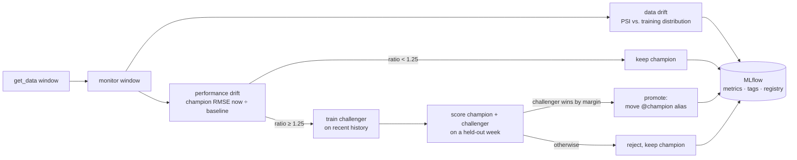

# MLflow drift loop

**track → detect drift → retrain a challenger → promote.** A model-monitoring
loop that catches a deployed model going stale and fixes it on its own: it tracks
a champion model, measures two independent kinds of drift, trains a challenger on
recent data when the champion decays, and promotes the challenger only if it wins
on a window neither model has seen. Every decision — metrics, tags, and the model
registry — is logged to MLflow, so the whole history is auditable.

The worked example is air quality: a model that predicts Kraków's PM2.5 from the
weather, trained on clean summer air, decaying as the winter heating season fills
the basin with smog — and the loop keeping it accurate through the shift.

**Live dashboard → https://ldele.github.io/mlflow-drift-loop/** (interactive
charts, rebuilt weekly).

## The loop

One scheduled run monitors the current champion over a rolling window and makes
one decision. Two drift signals are computed independently; only a drop in the
champion's *performance* triggers a retrain, and a challenger is promoted only if
it wins on a held-out window neither model was trained on.



### Two independent drift signals

The champion/challenger logic isn't circular because the two signals answer
different questions and are driven by different things:

| Signal | Measures | Needs a model? | Drives |
|---|---|---|---|
| **Data drift** (PSI, KS cross-check) | the *world* changed | no | early warning |
| **Performance drift** (champion RMSE now ÷ at training time) | the *model* is failing | champion only | the retrain trigger |

The synthetic source (below) makes this concrete: it has two knobs, and
[`scripts/sweep_knobs.py`](scripts/sweep_knobs.py) shows each knob moves exactly
one signal. `feature_shift` moves **PSI** while performance stays flat;
`drift_strength` moves **performance drift** while PSI stays flat.

### No evaluation leak

When performance drift fires, the challenger trains on recent history **ending
before** a most-recent `holdout` window, and both champion and challenger are
scored on that holdout — which neither model has seen. Promotion happens only if
the challenger wins by a margin. `run_simulation` refuses a run cadence shorter
than the holdout, and [`tests/test_loop.py`](tests/test_loop.py) asserts the
windows can't overlap. (This was the bug in the original prototype: it trained the
challenger on part of the window it was then scored on.)

## The data

One swappable `get_data(start, end)` contract sits under the whole thing, so the
loop, drift math, and dashboard never change — only the data does. Three sources
implement it; the dashboard's selector switches between them.

- **Kraków air quality — real.** Weather (temperature, wind, humidity) from the
  [Open-Meteo](https://open-meteo.com/) ERA5 archive, joined on the hour with
  PM2.5 from its air-quality API. A champion trained on summer 2025 is replayed
  weekly into winter: PM2.5 mean rises from **~10 µg/m³** (summer) to **~54**
  (winter), the champion's RMSE climbs from **~4.5 to ~49**, and the loop fires
  **9 retrains and 7 promotions** across 23 runs (two early retrains were
  *rejected* — the challenger didn't clear the margin).
- **Synthetic — controlled proof.** A deterministic world with two drift knobs,
  used to prove detection fires exactly when — and only when — the data is made
  to shift. This is where the two-signal independence is demonstrated.
- **Live schedule — the loop running by itself.** The same loop, but run **one
  incremental cycle at a time** against a **persistent** backend, driven weekly by
  a GitHub Action. It bootstraps a champion on first run, then appends one
  monitoring cycle per week, accruing its own history over calendar time.

Each source logs to its own MLflow backend file (`mlflow.db`,
`mlflow_openmeteo.db`, `mlflow_scheduled.db`) so they reset and browse
independently.

## Everything we gather is stored

Nothing fetched or computed is thrown away:

- **Raw observations are committed.** The hourly Open-Meteo data lands in
  `data_cache/*.parquet` and is versioned in the repo, not re-fetched — so the
  charts always match a fixed, inspectable dataset.
- **Live history persists.** The weekly Action commits `mlflow_scheduled.db` and
  its artifacts back to the repo, so each scheduled cycle continues from the last
  (each run is otherwise a fresh VM). The synthetic and Kraków run histories are
  regenerated deterministically from the committed inputs on each site build.
- **The published site carries the data with it.** [`build_site.py`](scripts/build_site.py)
  emits both the distilled `data.json` the charts read *and* the full raw
  `krakow_hourly.csv`, both downloadable straight from the live page.

## What MLflow tracks

Each monitoring run logs, as time-series metrics: `data_drift_psi`,
`perf_drift_ratio`, `champion_rmse`, `champion_mae`, `champion_r2`,
`champion_baseline_rmse`, per-feature `psi_*`/`ks_*`, and — when a challenger is
trained — `challenger_rmse`, `champion_rmse_holdout`, `performance_gap`. Tags
record `drift_detected`, `retrain_triggered`, `promotion_decision`. Each run also
logs two artifacts under `monitoring/` (the champion's predictions on the window
and a feature-distribution report), so the dashboard's detail panels stay
decoupled from the data source. Registered model versions carry their learned
**coefficients as tags**, and a promotion moves the `champion` **alias** in the
Model Registry — an auditable version history.

> MLflow's Model Registry needs a database backend, so this uses a local
> **SQLite** file (still zero-setup, single-file) rather than a file store.
> MLflow 3 also replaced `Staging`/`Production` stage transitions with aliases.

## Quickstart

```powershell
# from this folder
uv venv -p "C:\Users\LDELEZ\AppData\Local\Python\pythoncore-3.12-64\python.exe"
uv pip install --system-certs -e ".[dev]"

# Kraków air quality — fetch/cache the real span, then run the loop
.venv\Scripts\python.exe scripts\run_openmeteo.py --fresh

# Synthetic — the controlled proof
.venv\Scripts\python.exe scripts\run_simulation.py --fresh   # bootstrap + replay weekly runs
.venv\Scripts\python.exe scripts\sweep_knobs.py              # prove the two signals are independent

# Live schedule — one incremental cycle (bootstrap first run, monitor thereafter).
# --as-of lets you backfill / replay "weekly" runs locally:
.venv\Scripts\python.exe scripts\run_scheduled.py --as-of 2025-09-15   # first fire: bootstrap
.venv\Scripts\python.exe scripts\run_scheduled.py --as-of 2025-10-15   # next fire: monitor + maybe retrain

.venv\Scripts\python.exe -m streamlit run dashboard\app.py   # dashboard (selector picks the source)
.venv\Scripts\python.exe -m pytest                           # tests
```

> **Running on Windows.** Two machine-specific gotchas, both about TLS:
> - Build the venv from a **python.org** interpreter (the `-p …pythoncore-3.12…`
>   above), not a `uv python install` one — some `python-build-standalone` builds
>   ship an OpenSSL that aborts with `OPENSSL_Uplink: no OPENSSL_Applink` the
>   moment MLflow loads a CA certificate. Check any interpreter with
>   `python -c "import ssl; ssl.create_default_context()"`.
> - Behind a TLS-intercepting corporate proxy, `uv` needs `--system-certs` and the
>   Open-Meteo calls route through the OS trust store via `truststore.inject_into_ssl()`;
>   without it you'd get `CERTIFICATE_VERIFY_FAILED`.

## Layout

```
src/driftloop/
  config.py          column contract, knobs/thresholds, Open-Meteo + source configs
  data/
    base.py          the get_data(start, end) interface + a contract validator
    synthetic.py     deterministic synthetic world, two drift knobs
    openmeteo.py     real source: weather + air quality, joined + disk-cached
  drift.py           PSI, KS, distribution report, performance-drift computations
  model.py           the (deliberately simple) Ridge pipeline + metrics + coefficients
  tracking.py        MLflow setup, registry, champion alias, per-source backend/reset
  loop.py            one scheduled run: detect → maybe retrain → maybe promote
scripts/
  run_openmeteo.py   real Kraków data: fetch/cache, then run the loop
  run_simulation.py  synthetic: bootstrap + replay weekly runs across the shift
  sweep_knobs.py     the two-knob independence demo (offline, no MLflow)
  run_scheduled.py   one incremental cycle against the persistent backend
  build_site.py      distil the backends into site/data.json (+ raw CSV) for Pages
.github/workflows/
  drift-loop.yml     weekly cron: one live cycle, persist state + gathered data
  pages.yml          build the data + publish the static dashboard to GitHub Pages
site/                committed shell (index.html, app.js); fetches data.json, renders charts
dashboard/           Streamlit dashboard (app.py) + shared chart theme (theme.py)
tests/               data contract, drift math, no-leak guards, Open-Meteo (mocked)
```

## Viewing it online

- **GitHub Pages (live):** <https://ldele.github.io/mlflow-drift-loop/> — an
  interactive static dashboard. The data lives in a plain, inspectable
  `data.json` that `build_site.py` distils from the MLflow backends; the committed
  shell (`site/index.html` + `site/app.js`) fetches it and renders Plotly charts
  client-side (hover / zoom / source switch — no server). `pages.yml` rebuilds and
  republishes on every push and weekly.
- **Streamlit Community Cloud:** the full app. Deploy at <https://share.streamlit.io>
  → *New app* → this repo, main file `dashboard/app.py` (Python 3.12).
  `requirements.txt` is committed for it.

## Limitations & next steps

- **State lives in git.** Committing the SQLite backend + artifacts back to the
  repo is the simplest zero-infra persistence and keeps the drift history
  versioned, but it grows the repo over time. Production would point
  `MLFLOW_TRACKING_URI` at a hosted tracking server with an object-store artifact
  root and drop the commit-back step.
- **Artifact paths are absolute.** MLflow stores artifact URIs as absolute paths,
  so a backend generated on the CI runner resolves *metrics/params/tags* anywhere
  (the whole drift story travels fine) but not the per-run prediction/distribution
  *files* on a different machine.
- **No serving yet.** The champion is registered and promoted but not served
  behind an API — the natural next step, along with an alert when a promotion
  fires.
