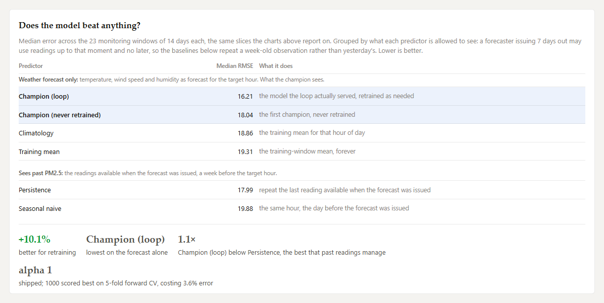

# MLflow drift loop

A model goes stale when the world stops matching what it was trained on. This
watches for that happening, retrains when it does, and ships the new model only
when it wins on data neither has seen.

It runs on real air quality from three cities, and the loop is the point: drift
detection, a model registry, champion/challenger, promotion gates, and a weekly
cron that keeps going on its own.

**[See it running →](https://ldele.github.io/mlflow-drift-loop/)**


## The loop

One scheduled run a week, four steps:

| | | |
|---|---|---|
| **1. Monitor** | score the live champion on the last 14 days | |
| **2. Detect** | PSI on the features, and error against training time | two signals, independently |
| **3. Retrain** | error crossed 1.25×, so train a challenger on 45 days | only if step 2 says so |
| **4. Promote** | both scored on a held-out week neither has seen | challenger wins by 5% or it is rejected |

**Why two signals.** Data drift needs no labels and no model, which makes it the
early warning. Performance drift is what triggers the retrain. Deciding "has it
drifted?" by comparing champion to challenger would be circular: you would need a
challenger before you were allowed to decide you needed one.

**No evaluation leak.** The challenger trains on a window that stops before the
holdout, and the champion was trained long before it. Both are scored on data
neither has seen, and the challenger has to clear a margin, not just edge ahead.

## Three cities that disagree

Weather from the [Open-Meteo](https://open-meteo.com/) ERA5 archive joined on the
hour with PM2.5 from its air-quality API. Each city trains a champion on a clean
season and replays weekly into the season that ruins it.

| | span | PM2.5 swing | champion RMSE | retrains / runs |
|---|---|---|---|---|
| **Kraków** | May 25 → Feb 26 | ~10 → ~54, winter smog in a basin | 4.5 → peak 49.1 | 9 / 23 |
| **Delhi** | May 25 → Feb 26 | 42 → 127, post-monsoon burning | 20.2 → peak 66.4 | 7 / 16 |
| **Los Angeles** | Sep 25 → Jul 26 | 15 → 29, a mild winter bump | peak 17.3, **ends at 5.8** | 3 / 37 |

Los Angeles is the control, and the measurements decided that, not the plan. It
was picked as the summer-smog city; hourly PM2.5 over 2025–26 peaks in November
and bottoms out in June. Its champion trains on the autumn peak and improves as
the year walks into a clean summer.

A fourth source, **Live schedule**, is the same Kraków data run one incremental
cycle at a time by a weekly GitHub Action, accruing its own history over calendar
time. A fifth, synthetic, has two independent drift knobs and backs the offline
correctness proof in [`sweep_knobs.py`](scripts/sweep_knobs.py); it is not
published.

## Does the model beat anything?

Worth answering out loud, because the answer is partly no.



Every predictor is scored on the same 14-day monitoring windows the loop reports
on, so the served champion, a champion that never retrained, and four
no-training baselines are directly comparable.

- **Retraining earns its keep where drift is real:** +26.9% in Kraków, +53.8% in
  Delhi against never retraining. Delhi's frozen champion is worse than a
  constant, which is concept drift doing exactly what it says.
- **It costs 12.7% in Los Angeles.** Retraining a city whose world barely moves
  fits noise. A drift loop needs drift.
- **Persistence beats everything, everywhere, by 3–4×.** Repeating the last
  reading is a much better PM2.5 predictor than weather is. The Ridge has no
  autoregressive term, so this is a limit of the framing, not a defect.

`alpha=1.0` ships; forward-chaining CV picks 30–100 depending on the city, worth
0.1–2.4% error. The curve is nearly flat, which says the model is limited by what
three weather features can express.

## The model, and what it is not


`StandardScaler → Ridge(alpha=1.0)` on temperature, wind speed and humidity,
predicting hourly PM2.5. Trained on a chronological 80/20 tail split, never a
random one, then refit on the full window.

It is kept small so that it decays visibly when the relationship shifts, where a
larger model would absorb some of the drift and hide it. **The
modelling is not the interesting part of this project.** The loop around it is,
and it would be unchanged if you dropped in something bigger. Every threshold is
identical across cities, so a city's behaviour reflects its weather and not its
tuning.

## Quickstart

```bash
uv venv && uv pip install -e ".[dev]"

python scripts/run_openmeteo.py --fresh     # all three cities (--city krakow|delhi|la)
python scripts/benchmark.py                 # baselines + alpha sweep
python scripts/build_site.py                # -> site/data.json

streamlit run dashboard/app.py              # the full app
mlflow ui --backend-store-uri sqlite:///mlflow_openmeteo.db
```

The synthetic proof is `scripts/run_simulation.py --fresh` and
`scripts/sweep_knobs.py`. The live cycle is `scripts/run_scheduled.py --as-of
YYYY-MM-DD`.

## What MLflow tracks

Per monitoring run, as time-series metrics: `data_drift_psi`,
`perf_drift_ratio`, `champion_rmse`/`mae`/`r2`, `champion_baseline_rmse`,
per-feature `psi_*` and `ks_*`, plus `challenger_rmse`, `champion_rmse_holdout`
and `performance_gap` when a challenger exists. Tags record `drift_detected`,
`retrain_triggered` and `promotion_decision`. Registered versions carry their
learned coefficients as tags, and a promotion moves the `champion` **alias**,
which is an auditable version history.

> The Model Registry needs a database backend, so this uses a local SQLite file.
> MLflow 3 replaced `Staging`/`Production` transitions with aliases.

## Nothing gathered is thrown away

Raw hourly observations are committed as `data_cache/*.parquet` instead of being
re-fetched, so the charts always match a fixed, inspectable dataset. The weekly
Action commits `mlflow_scheduled.db` back to the repo so each cycle continues
from the last. The published site carries its own data: a distilled `data.json`
plus one raw CSV per city, both downloadable from the live page.

## Layout

```
src/driftloop/    config, data sources, drift math, model, loop, benchmark
scripts/          run_openmeteo · benchmark · build_site · run_scheduled · sweep_knobs
site/             committed shell (index.html, app.js) + generated data.json
dashboard/        Streamlit app and shared chart theme
docs/wireframes/  the drawings each UI was built from
tests/            data contract, drift math, no-leak guards, Open-Meteo (mocked)
```

Also on **Streamlit Community Cloud**: deploy this repo with `dashboard/app.py`
as the main file, Python 3.12.

## Limitations

- **State lives in git.** Committing the SQLite backend back to the repo is the
  simplest zero-infra persistence and keeps history versioned, but it grows the
  repo. Production would point `MLFLOW_TRACKING_URI` at a hosted tracking server.
- **Artifact paths are absolute.** A backend generated on the CI runner resolves
  metrics, params and tags anywhere, but not the per-run prediction files.
- **No serving.** The champion is registered and promoted, never served behind an
  API. That and an alert on promotion are the obvious next steps.
- **No autoregressive features**, which is why persistence wins the benchmark.
