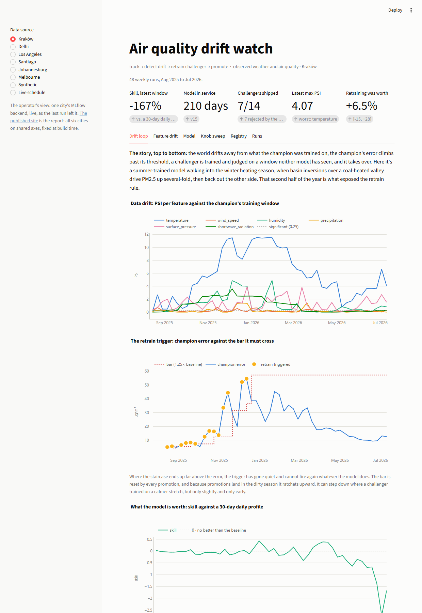
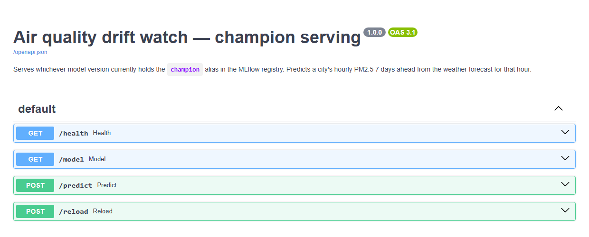

# Air quality drift watch

[](https://github.com/ldele/mlflow-drift-loop/actions/workflows/ci.yml)

Models go stale. The world they were trained on moves on, and usually nobody
notices until something downstream breaks.

This system notices on its own. Every week it marks its own homework. When the
model it is running starts slipping, it trains a replacement, and it refuses to
ship that replacement unless it beats the one already in service. Six cities are
replayed week by week across a full year of weather, from 2025 into 2026.

The job it does is forecasting how dirty a city's air will be a week from now,
using nothing but the weather forecast. Six cities on six continents.

**[See it running →](https://ldele.github.io/mlflow-drift-loop/)**



## The loop

One run a week, four steps:

| | | |
|---|---|---|
| **1. Mark its homework** | check the last 14 days of forecasts against what the air did | |
| **2. Look for trouble, two ways** | has the weather stopped looking like what the model learned from, and separately, is the model's error rising? | two signals, on purpose |
| **3. Train a rival** | error is 1.25× what it used to be, so train a fresh model on the last 180 days | only if step 2 says so |
| **4. Make it earn the job** | both sit the same exam, a week of air neither has seen | the newcomer wins by 5% or it is thrown away |

Why two signals and not one? The first looks only at the weather coming in, so it
can raise a hand immediately, without waiting to find out whether the model was
wrong. But "the world looks different" is not the same as "the model is failing".
Kraków shows the gap: through the summer its weather drifts further from training
than anywhere else here, while the model quietly gets better. So the cheap alarm
watches, and only the expensive one, the one that asks whether we got this wrong,
can authorise spending money on a retrain.

Nothing is graded on work it has already seen. The replacement trains on a window
that stops before the exam, the incumbent was trained long before it, and both
are marked on the same unseen week. Details in
[methodology.md](docs/methodology.md).

### The alarm that goes deaf

**The expensive signal is measurably the wrong shape.** It compares the model
against *its own* error at training time, and every promotion resets that
comparison. Retrains fire in the dirty season, so each new model inherits a
higher bar than the one it replaced and the bar never comes back down. Kraków's
rises from 3.7 to 45.8 µg/m³, after which nothing can cross it: the last 30 of
its 48 weeks are a 210-day-old model reported as healthier than it has ever
been, while its skill against a plain 30-day daily profile is the worst it has
ever been. Finding that is what the site is built to do.

Then the fix was built, and it does not pay. Two were proposed. An absolute error
floor cannot be built at all: waking the quietest city needs a floor low enough
to retrain the dirtiest one every week, and the gap between them is empty. A
model-independent yardstick can be, and now is. The trigger also fires when skill
against the daily profile drops below a floor, which nothing about promoting a
model can move, and it wakes the alarm as intended: Kraków's longest silence
falls from 30 weeks to 5. Replayed across all six cities it then changes nothing
in five of six at a conservative setting, and at an aggressive one makes two of
them worse for one improvement. So it ships switched off.

That pointed at the seven-day exam instead, so the exam was lengthened to 10, 14
and 21 days and replayed the same way. It does not pay either. Over the horizon
it tests the promise gets more honest, and beyond that horizon nothing moves:
every long-serving promotion still delivers a negative margin at every length,
and a longer exam blocks challengers that the cities needing them cannot afford
to lose.

**Two negative results are the useful finding here.** The reversal is not a
matter of the trigger being too deaf or the exam too small, because making each
more sensitive was measured and neither helped. What is missing is a third mechanism:
nothing re-examines a champion on fresh unseen data while it is serving. Both
existing checks look at promotion time or at the model's own history. Neither of
those conclusions would exist if the fixes had been argued instead of run.

## Six cities that disagree

Retraining pays where the world really moved, and costs where it did not. That
is the finding worth having, and it takes contrasting cities to show it.

Each city trains a model on a clean season, then runs week by week into the
season that ruins it. Every setting is identical across all six, so where two
cities behave differently, it is their air that differs and not their tuning.

Two columns for retraining, because one of them lies. The first compares the
median error across the whole replay against never retraining. It is unpaired,
so in a city that promotes nothing until week 14 of 20 most windows compare the
first model against itself and the answer collapses toward zero. The second holds
the window fixed and compares the two models week by week, over the weeks a
retrained model was serving.

| | how bad it gets (µg/m³) | weeks | retrains | across the replay | week by week |
|---|---|---|---|---|---|
| **Delhi** | 42 → 127, crop burning after the monsoon | 40 | 9 | **+43.8%** | **+49.4%**, won 92% of 38 |
| **Santiago** | 18 → 94, winter smog trapped in a bowl | 22 | 13 | **+12.9%** | **+17.3%**, won 100% of 16 |
| **Kraków** | 8 → 57, coal heating in a valley | 48 | 14 | +0.2% | +6.5%, won 72% of 47 |
| **Johannesburg** | 23 → 84, winter coal smoke | 20 | 11 | 0.0% | **+14.9%**, won 100% of 6 |
| **Melbourne** | 5 → 15, winter wood heaters | 31 | 8 | 0.0% | +1.2%, won 70% of 27 |
| **Los Angeles** | 15 → 29, a mild winter bump | 37 | 3 | −8.9% | −2.8%, won 50% of 36 |

In Delhi, where the air transforms, keeping the model fresh roughly halves its
error. In Los Angeles it is a coin toss that costs money to play: half the weeks
it acted came out ahead, and the median week came out 2.8% behind. Los Angeles is
the control, and it earns its place by failing.

Johannesburg is where the promotion gate does its most visible work, and where
the unpaired number misleads hardest. Eleven retrains, three shipped, the other
eight thrown away for failing to clear the margin. Across the replay that reads
as 0.0%. Week by week, in the six weeks a retrained model was serving, it beat
the original in all six by a median of 14.9%.

Half these cities are dirtiest in June to August and the other half in December
to January, which is how you can tell the thresholds are not secretly encoding a
season.

**A seven-day exam certifies a model for a month, not for half a year.** Every
promotion left a prediction behind, the margin the challenger won by, so the gate
can be checked against what each winner went on to deliver. Across 29 promotions
it is well calibrated for about five weeks: +12.3% promised, +9.7% delivered,
none of them harmful. Beyond twenty weeks it reverses sign, promising +13.9% and
delivering −5.9%, with all three harmful. Tripling the exam does not help, which
is how you can tell this is drift rather than a small sample. And the models that
serve half a year are the ones the ratcheted trigger can no longer replace, so
the two faults compound.

[evaluation.md](docs/evaluation.md) has the city-by-city detail, how the model
scores against four "do nothing clever" baselines, the gate calibration in full,
and a controlled experiment showing that each alarm responds to its own cause and
ignores the other.

### What a full year exposed

The cities originally stopped at their winter peak. On that half of the story,
retraining looked like a clear win everywhere. Running them through the return
trip, as the air gets clean again, reversed the sign: retraining came out 29.6%
worse in Kraków and 4.3% worse in Delhi.

The fault was in the retraining rule, not the machinery. A replacement trained on
the last 45 days only ever sees one season. It is excellent in the season it was
born in and wrong as soon as the year turns. Widening that window to 180 days
took Delhi from −4.3% to +43.8%.

This is the most useful finding in the repository. The loop was behaving correctly
the whole time, faithfully shipping replacements that won their exam and then
aged badly, and only a full year of data made it visible.

## Serving the champion

The whole output of the loop is one label. `champion` points at whichever model
last passed its exam, and the API serves whatever wears that label, so promoting
a model is deploying it. No redeploy, no config change.



```bash
python scripts/serve.py --city krakow      # http://localhost:8000/docs
docker build -t drift-serve --build-arg CITY=delhi .
docker run -p 8000:8000 drift-serve
```

Kraków serves the model left standing after 14 retrains, and `/model` reports the
window it was trained on, so you can see how stale the model answering you is.

It does not poll. A new model is picked up when `/reload` is called, because
swapping the model under live traffic without anyone asking is worse than serving
a slightly stale one. Predictions come back twice: `pm25` floored at zero for
whoever is consuming it, and `pm25_raw` as the model said. A clamp that
hides what your model is doing is how you stop noticing it.

## Quickstart

```bash
uv venv && uv pip install -e ".[dev]"

python scripts/run_openmeteo.py --fresh     # all six cities (--city krakow|santiago|delhi|joburg|melbourne|la)
python scripts/benchmark.py                 # baselines + alpha sweep
python scripts/sweep_skill_floor.py         # does waking the retrain trigger help? (no)
python scripts/sweep_holdout.py             # does a longer promotion exam help? (also no)
python scripts/build_site.py                # -> site/data.json

streamlit run dashboard/app.py              # the full app
python scripts/serve.py --city krakow       # serve the champion on :8000
mlflow ui --backend-store-uri sqlite:///mlflow_openmeteo.db

pytest -q && ruff check .                   # what CI gates on
```

Also on **Streamlit Community Cloud**: deploy this repo with `dashboard/app.py`
as the main file, Python 3.12.

## Layout

```
src/driftloop/    config, data sources, drift math, model, loop, retrospect, benchmark, serving
scripts/          run_openmeteo · benchmark · build_site · run_scheduled · sweep_knobs ·
                  sweep_skill_floor · sweep_holdout · serve
site/             committed shell (index.html + app.js, compare.html + compare.js,
                  shared.css) + generated data.json
dashboard/        Streamlit app and shared chart theme
docs/             methodology · evaluation · wireframes each UI was built from
tests/            data contract, drift math, no-leak guards, baseline fairness,
                  retrospective scoring, serving, charts, site assets
```

- **[methodology.md](docs/methodology.md)** covers how it works: what a Ridge
  does and why it is barely doing it here, the features and the physics behind
  each one, what PSI computes and where it stops meaning anything, the window
  layout, the guards against cheating, and a reading list.
- **[evaluation.md](docs/evaluation.md)** covers whether it works: per-city
  results, the baselines, the controlled experiment, and the limitations.

The model itself is weak, and that belongs up front rather than in a footnote.
Guessing an hour's pollution from a week-old weather forecast is hard, and the
numbers show it. What is worth looking at is the machinery around the model,
which would be unchanged if you dropped in something far better.
