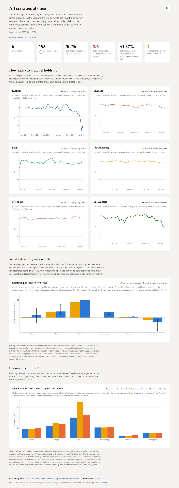
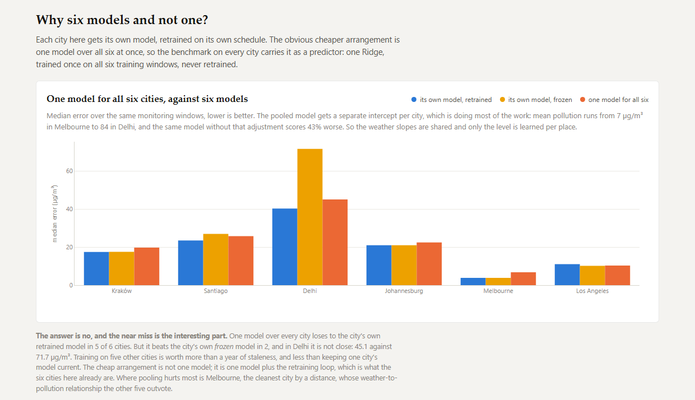
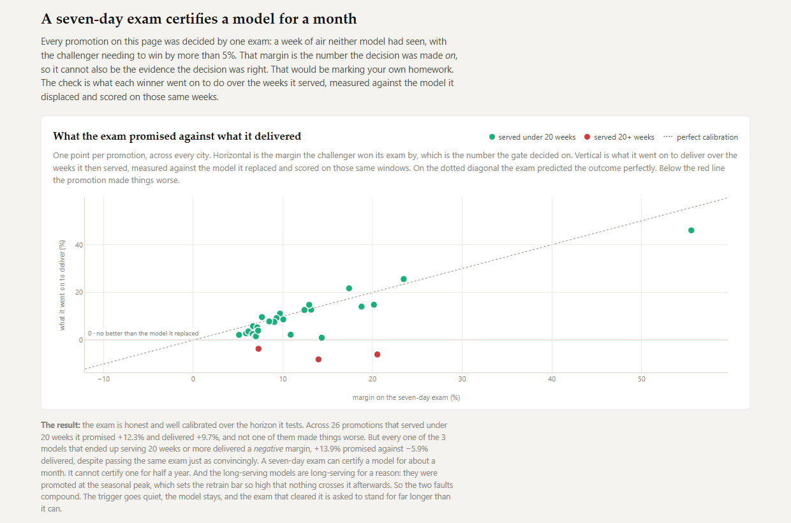
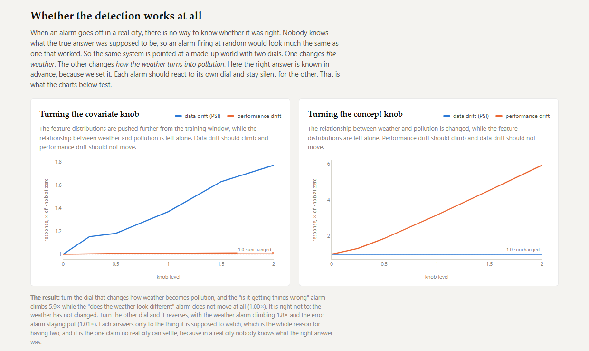

# Evaluation

Whether it works, and where it does not. For how it works, see
[methodology.md](methodology.md).

## Six cities that disagree

Weather forecasts from the [Open-Meteo](https://open-meteo.com/) historical
forecast archive, joined on the hour with observed PM2.5 from its air-quality
API. Each city trains a model on a clean season and replays week by week into the
season that ruins it, and then out the other side.

| | span | PM2.5 swing | model error, start → worst | weeks | retrains | shipped |
|---|---|---|---|---|---|---|
| **Delhi** | May 25 → Jul 26 | 42 → 127, post-monsoon burning | 33.4 → 99.0 | 39 | 9 | 8 |
| **Santiago** | Oct 25 → Jul 26 | 18 → 94, winter inversion in a basin | 6.2 → 68.3 | 21 | 13 | 7 |
| **Kraków** | May 25 → Jul 26 | 8 → 57, winter smog in a basin | 5.1 → 54.5 | 48 | 14 | 7 |
| **Johannesburg** | Nov 25 → Jul 26 | 23 → 87, Highveld coal smoke | 12.0 → 82.3 | 19 | 11 | 3 |
| **Melbourne** | Sep 25 → Jul 26 | 5 → 15, winter wood heaters | 3.8 → 15.0 | 30 | 8 | 4 |
| **Los Angeles** | Sep 25 → Jul 26 | 15 → 29, a mild winter bump | 16.4 → 20.8 | 36 | 1 | 1 |

**Retrains and shipped are different numbers, and the gap is the gate doing its
job.** Johannesburg trains eleven challengers and promotes three; the other
eight failed to clear the margin and were discarded. An earlier version of this
table collapsed the two into a single "retrains" column, which hid the gate
in the one city where it worked hardest.

What retraining was worth, with the interval on every figure:

| | across the replay | week by week | won |
|---|---|---|---|
| **Delhi** | +43.7% [+28.7, +64.2] | **+49.4% [+33.7, +61.8]** | 92% [79, 97] of 38 |
| **Santiago** | +16.8% [−0.0, +42.5] | **+17.3% [+9.0, +37.0]** | 100% [81, 100] of 16 |
| **Kraków** | +0.2% [−57.2, +35.5] | +6.5% [−15.3, +27.5] | 72% [58, 83] of 47 |
| **Johannesburg** | −0.0% [−0.0, +21.3] | **+14.9% [+8.7, +21.4]** | 100% [61, 100] of 6 |
| **Melbourne** | +0.1% [−3.1, +6.5] | +1.2% [−0.6, +3.0] | 70% [52, 84] of 27 |
| **Los Angeles** | −7.9% [−29.1, +0.4] | **−13.4% [−36.9, −3.8]** | 29% [16, 45] of 35 |

95% moving-block-bootstrap intervals, regenerated by
[`scripts/uncertainty.py`](../scripts/uncertainty.py). Bolded where the interval
excludes zero. Win rates carry a Wilson interval instead, for a reason given
below. **Read [the next section](#what-the-intervals-cost-this-page) before
quoting anything from this table.** Two of these six results do not survive it,
and one of the two was previously described here as a finding.

The two retraining columns disagree, and the second is the one to trust when they
do. "Across replay" compares the median error of what was served against the
median of the first model held frozen. That comparison is unpaired: where both
distributions are dominated by the same seasonal swing, it largely measures the
season. Johannesburg promotes nothing until week 14 of 20, so 70% of its windows
have the two models identical, both medians land on the same value, and the
column reads 0.0%. "Week by week" holds the window fixed, compares the two models
in it, and reports the median of those per-window ratios over the weeks a
retrained model was serving, alongside how often it won.

Which windows those are is decided by the version in service, not by whether the
two error figures differ. The served figure is the loop's own logged error and
the frozen one is rebuilt from coefficient tags, so for the identical model they
agree only to six decimals; testing them for equality marks every window as
retrained and averages in the ones from before anything was promoted.

The same question has a boundary case at the very first run. The bootstrap
champion is registered before any monitoring cycle exists, so a first run that
promotes has no earlier row to read the outgoing version off, and its own tag has
already been overwritten with the winner. The replaced version is in the registry
rather than in the run log: it is the lowest registered version, the same model
the frozen comparison uses. Without that rule, a window served by the bootstrap
champion counts as retrained and a real promotion goes unjudged by the gate
calibration below.

### How these six cities were chosen

Six is a small number and they were picked by hand, so the reasonable suspicion
is selection: that cities were tried, and the ones that behaved were kept. The
git history answers it, and is the reason this section can be checked rather
than merely asserted.

They were added in three batches, and **no city was ever removed**:

| added | commit | cities |
|---|---|---|
| 2026-07-31 | `4d4d8db` | Kraków, the original, and the only one the loop was built against |
| 2026-07-31 | `53d0cca` | Delhi and Los Angeles, chosen as the extremes: the most drift-exposed city available, and one expected to show none |
| 2026-08-01 | `95b6ae1` | Santiago, Johannesburg, Melbourne |

`git log -S<CITY> -- src/driftloop/config.py` reproduces this, and a diff of
every commit touching that file shows six `OpenMeteoConfig` blocks added and
none deleted.

Two things this establishes and one it does not. It establishes that no city was
dropped after its result was seen, and that Los Angeles was added *as* a control
rather than promoted to one after it failed to benefit. It arrived in the same
commit as Delhi, explicitly as the other extreme. It does not establish that the
six are a random sample of world cities. They are not. They were chosen for
contrast, half peaking in June–August and half in December–January, which is
what makes them able to show that the thresholds are not encoding a season, and
is also what makes them unsuitable for estimating how often retraining pays in
general. No claim of that kind is made here.

### What the intervals cost this page

Until 2026-08-11 every number above was published as a bare point estimate. That
was the one place this project failed its own standard: it argues at length about
leakage, baselines and counterfactuals, and then printed `+43.7%` and `+0.2%` in
one table, in one typeface, with nothing to tell the reader that the first is a
finding and the second is noise.

**The weeks are not independent observations, and treating them as such is not a
small error.** A monitor window is 14 days wide and the replay steps 7, so
consecutive windows share half their hours outright. Underneath that, pollution
episodes last days to weeks. So the intervals come from a moving-block bootstrap
(Künsch, 1989), resampling contiguous runs of weeks rather than individual ones.
[`driftloop/stats.py`](../src/driftloop/stats.py) has the method and its caveats.

How much independent information each replay carries:

| | weeks compared | effective n | lag-1 autocorrelation | block length |
|---|---|---|---|---|
| **Delhi** | 38 | 10 | 0.57 | 3 |
| **Santiago** | 16 | 2 | 0.75 | 3 |
| **Kraków** | 47 | 5 | 0.79 | 4 |
| **Johannesburg** | 6 | 5 | 0.08 | 2 |
| **Melbourne** | 27 | 8 | 0.55 | 3 |
| **Los Angeles** | 35 | 3 | 0.85 | 3 |

Kraków's forty-seven weeks are worth about five independent observations.
Los Angeles's thirty-five are worth three. That is the single most
uncomfortable table on this page, and it explains every interval above it.

**Two of the six results do not survive.**

- Kraków's +6.5% is not distinguishable from zero, at [−15.3, +27.5]. It was
  never described as large, but it was described as a positive result and
  reported alongside a 72% win rate, which reads as a weak effect rather than as
  no measurable effect.
- Melbourne's +1.2% is not distinguishable from zero, at [−0.6, +3.0]. Small,
  positive and worth nothing, as the site's own commentary nearly said.

Four survive, including the one that matters most. Delhi's premium is large
and holds at every block length. Santiago's and Johannesburg's are real. And **Los Angeles's −13.4%
[−36.9, −3.8] excludes zero**, which upgrades the control from an anecdote to a
result: retraining that city measurably *hurts* it. The claim that retraining
pays where the world moved and costs where it did not now rests on intervals at
both ends rather than on point estimates at both ends.

#### The block length is a knob, so here is the sweep

Block length is the one free parameter in this method, which makes it the one
place a convenient answer could be quietly selected. The week-by-week premium at
several block lengths, where `L=1` redraws single weeks:

| | L=1 | L=2 | L=3 | L=4 | L=6 | L=8 |
|---|---|---|---|---|---|---|
| **Delhi** | [+41, +57] | [+35, +58] | [+34, +62] | [+27, +62] | [+20, +63] | [+18, +63] |
| **Santiago** | [+10, +37] | [+9, +37] | [+9, +37] | [+9, +37] | [+9, +37] | [+10, +37] |
| **Kraków** | [+4, +18] | [+3, +25] | [+3, +27] | [−15, +28] | [−49, +28] | [−49, +28] |
| **Johannesburg** | [+9, +21] | [+9, +21] | [+9, +21] | — | — | — |
| **Melbourne** | [+0, +3] | [−1, +3] | [−1, +3] | [−1, +3] | [−1, +3] | [−1, +3] |
| **Los Angeles** | [−23, −4] | [−25, −4] | [−37, −4] | [−39, +1] | [−39, +1] | [−39, −4] |

**Kraków changes its answer.** At `L=1` the interval is [+4, +18] and excludes
zero; from `L=4` it does not. Kraków is also the most autocorrelated series in
the set at ρ = 0.79, so the block bootstrap is the right tool and the IID reading
is the wrong one. The conclusion is still a function of a modelling choice, and
it is published rather than buried. This is the case the sweep was built to
catch, and it caught it on the first run.

Los Angeles wobbles at `L=4` and `L=6` and is otherwise stable. Delhi, Santiago,
Johannesburg and Melbourne say the same thing at every setting.

#### Where the bootstrap cannot help

Santiago and Johannesburg won *every* window they acted on. Every bootstrap
resample therefore also wins every window, and the interval collapses to
[100, 100]. That is not certainty. It is the percentile bootstrap being unable
to represent uncertainty at a boundary. Win rates are therefore reported with a
Wilson interval, which handles the boundary properly: 16 of 16 becomes
[81, 100], and 6 of 6 becomes [61, 100]. Wilson assumes independent trials,
which these are not, so it is if anything still too narrow. Both flaws point the
same way, and a 100% win rate here should be read as "at least this good"
rather than as "always".

#### What is still not corrected

No multiple-comparisons correction is applied anywhere on this page, and the
exposure is no longer the six intervals of one table.

The sweeps alone account for most of it: five of them, 96 arms, and roughly 170
interval readings, since each arm is reported both over its whole replay and
over the weeks it changed the serving model. Seventeen of those clear zero. Add
the six-city table, the gate calibration, the ablation and the block-length
sweep and the page reports more than two hundred intervals.

There is no formal correction for two reasons. The arms are not independent:
within a city they share one replay, one weather history and often one
promotion, so the assumptions behind Bonferroni or Benjamini-Hochberg do not
hold, and applying either would produce a number with the shape of rigour and
none of the content. And the sections answer different questions, so there is no
one family to correct over. Whatever the right adjustment is, it is not one this
page can compute honestly, and an arbitrary one would be worse than none.

What can be said is which way the exposure cuts, and it is not the usual way.
**Multiplicity weakens a positive result and strengthens a negative one.**
Failing to find an effect in a single comparison is weak evidence; failing to
find it in eighteen, each with every opportunity to show one, is strong. Most of
the conclusions on this page are negative — a longer exam does nothing across
eighteen comparisons, re-certification buys no accuracy across twenty-four,
probation establishes nothing across eighteen — and the number of tests makes
those *more* credible rather than less.

It bites the positive claims instead, and they are few enough to name:

- **The skill floor's Los Angeles result**, +11.78% [+2.09, +17.17], is one arm
  of eighteen. It is the evidence [D1](DECISIONS.md) turns on, and D1 is the
  only decision this project leaves open. Read it as suggestive rather than
  established, which is a further argument for the two-new-cities resolution
  that decision already proposes.
- **Re-certification's Los Angeles results**, two arms of twenty-four.
- **Probation's Kraków result**, one arm of eighteen, discounted on exactly
  these grounds where it is reported.

Two findings are not weakened by any of this. The confidence gate's harm is five
arms of eighteen, all in the same direction and concentrated in the two cities
the mechanism predicts, which is well clear of what chance produces. And the
large city effects, Delhi's +49.4% and Santiago's +17.3%, sit nowhere near the
boundary, so no defensible correction reaches them. Johannesburg rests on six
acted windows and is the weakest of the surviving city results, for reasons of
sample size rather than multiplicity.

**The reading rule.** A single interval that barely clears zero inside a table
of eighteen is not a finding. One that clears it by a wide margin, or a whole
table that fails to clear it, is.

### Every replay starts clear of its own training data

Each city's `first_run` sits at least `monitor_days` after the bootstrap
champion's training ends, so the first monitor window contains no hour the
champion fitted. That was not true until 2026-08-06. Five of six cities started 9
to 11 days after training against a 14-day window, and run 0 scored the champion
on 3 to 5 days of its own training data, understating its error by 1.0% in
Johannesburg to 15.2% in Melbourne. No retrain decision changed, but a champion
graded on its own homework is the exact failure the rest of this page is built to
avoid, so the five replays were moved one week later and every number here was
regenerated.

Los Angeles moved most. It now fires one retrain in 36 weeks rather than three in
37, because two of the three fired inside the window that has been dropped, and
its paired result falls from −2.8% to −13.4%. That is the control city getting
more clearly negative, which is the direction the correction should push a city
whose retraining never paid. `tests/test_loop.py` asserts the gap for every
shipped profile, so a new city cannot reintroduce it.

The cities were picked on measurements rather than reputation. Eighteen
candidates were fetched and ranked by PM2.5 swing before any of them was wired
in, which cost two obvious choices. Sydney turned out flat, at 1.5×, with no
story in it. No Brazilian city worked either: the Amazon burning-arc cities peak
at only about 14 µg/m³ in this window, and São Paulo swings 1.7×, less than Los
Angeles does.

The same exercise settled the European slot. Over a current twelve-month window
Kraków swings 6.9×, ahead of Milan (6.2×), Tuzla (6.2×) and Katowice (6.1×),
and comfortably ahead of the cities that make the "worst air in Europe"
headlines: Sarajevo 4.7×, Skopje 4.4×, Sofia 3.7×. Reputation was a poor guide
again.

### What a full year exposed

Every city originally stopped at its dirty-season peak. On that half of the
story, retraining looked like an unambiguous win in both Kraków and Delhi.

Running them through the return trip, as the air gets clean again, reversed the
sign. Retraining came out worse than never retraining at all in both cities.

The cause was the retraining rule rather than the loop. A challenger trained on
the previous 45 days only ever sees one season, so it is excellent in the season
it was born in and wrong as soon as the year turns. The loop was behaving
correctly throughout. Each challenger won its holdout exam at the moment it was
promoted, and then aged badly.

Widening `challenger_train_days` from 45 to 180 fixed it:

| | 45-day window | 180-day window |
|---|---|---|
| Delhi, retraining worth | −7.2% | **+43.7%** |
| Delhi, median served error | 77.06 | **40.44** |
| Kraków, retraining worth | −29.6% | +0.2% |
| Kraków, median served error | 22.70 | **17.49** |

The paired reading tells the same story more quietly, +4.5% against +49.4% in
Delhi: even on the weeks a 45-day challenger was serving it barely helped, and
across the replay it did real damage.

Only a full annual cycle made this visible, which is the argument for running the
replay past the point that flatters the system.

### Where it stops paying

Los Angeles is the control, and the measurements chose it for that. It was picked
as the summer-smog city; hourly PM2.5 over 2025–26 peaks in November and bottoms
out in June. Its model barely moves across 36 weeks and the trigger fires once.
That single promotion wins 29% of the 35 weeks it then serves, and the median
week runs 13.4% behind having left the first model alone. There has to be drift
for a drift loop to earn anything.

Johannesburg is where the promotion gate does the most visible work. Error
climbs from 12.0 to 82.3 µg/m³, the worst on the page, and eleven retrains
produce only three promotions: the other eight challengers failed to clear the 5%
margin and were thrown away. The loop spends the effort, the gate declines to
pay, and nothing ships that did not earn it. When something did ship it worked:
in the six weeks a retrained model was serving it beat the original in all six,
by a median of 14.9%.

Melbourne is the counter-intuitive case. Its air stays near the WHO guideline all
year, yet the model still decays to more than four times its training error, so
clean air does not imply a stable model. Retraining still helps there, by 1.2%
week on week, which is the smallest real effect on the page.

### The loop has no calendar in it

Kraków, Delhi and Los Angeles all peak in northern winter, which leaves a fair
objection open. Are the thresholds quietly encoding a season? Santiago,
Johannesburg and Melbourne peak in June, July and August, when Kraków and Delhi
are at their cleanest, and they run on settings identical to every other city's.

Santiago answers it most directly, because it is Kraków's twin: a basin that
traps winter inversions the same way, half a year out of phase. Both decay by an
order of magnitude, both draw retrains off the same thresholds in opposite
seasons.

Kraków also supplies the cleanest evidence that the two signals are independent.
Across the second half of its replay, 21 weeks from February to July 2026, its
weather drifts *further* from the training window than anywhere else on the page,
while the model runs at well under its training error. Data drift screams, the
retrain trigger stays quiet, and no retrain fires. A system that retrained on
distribution shift alone would have burned twenty retrains there for no reason.

The trigger reaches the right answer by a route that had stopped working, which
is worth stating plainly rather than counting as a win. Measured against a
yardstick that holds still when a model is promoted, that same champion is at its
worst in that stretch, not its best. See
[The retrain trigger stops measuring staleness](#the-retrain-trigger-stops-measuring-staleness).

**Live schedule** is not a city and no longer shares the city selector. It is the
same Kraków data run one incremental cycle at a time, keeping its history in a
tracking store committed back to the repository. Two cycles have been recorded,
covering 2026-07-14 to 2026-07-20 and last logged on 2026-07-27. Drawing a city's
worth of charts from two points invited a comparison with a 48-week replay that
could only mislead, so it is now a short status block in the method section.

One caveat there is worth being exact about: the tracking store records that a
cycle happened, not what started it, so a cycle run by hand and one run by the
weekly Action are indistinguishable in it. The repository contains no commits
from the workflow's bot identity, and the two cycles are timestamped at 09:14 and
09:50 UTC against a 06:00 cron. That is consistent with both being run by hand.
Whether the Action itself has ever fired cannot be established from the
repository, and the page claims only the count and the dates.

A further source, synthetic, has two independent drift knobs and backs the
offline correctness proof in [`sweep_knobs.py`](../scripts/sweep_knobs.py). It is
not published.

## Does it beat the baselines?

Every predictor is scored on the same 14-day monitoring windows the loop reports
on, so the served model, a model that never retrained, and four no-training
baselines all land in one comparable column. They are grouped by what each is
allowed to see rather than ranked in a single list: persistence and seasonal
naive get the readings available when the forecast was issued, and the model gets
the weather forecast and nothing else.

Median RMSE, µg/m³, lower is better:

| | Delhi | Santiago | Kraków | Johannesburg | Melbourne | Los Angeles |
|---|---|---|---|---|---|---|
| **served model** | **40.44** | 24.54 | 17.49 | **21.13** | **3.97** | 10.91 |
| never retrained | 71.85 | 29.51 | 17.52 | 21.13 | 3.98 | **10.12** |
| one model, all six cities | 46.14 | 27.61 | 19.79 | 22.50 | 6.79 | 10.13 |
| climatology | 43.81 | 28.23 | 17.86 | 22.03 | 4.25 | 10.68 |
| training mean | 46.50 | 28.16 | 18.40 | 23.76 | 4.13 | 10.44 |
| persistence | 52.23 | 20.85 | **16.80** | 29.11 | 5.43 | 13.80 |
| seasonal naive | 49.72 | **20.19** | 18.56 | 30.56 | 5.12 | 14.34 |

- The model is the best predictor in Delhi, Johannesburg and Melbourne, and
  second in Kraków. It beats persistence in four of six.
- Retraining pays where drift is real. Delhi's never-retrained model ends up
  worse than a constant, which is what happens when nobody intervenes.
- Santiago is where the baselines win. Its pollution is persistent enough
  from week to week that repeating a stale reading beats forecasting from
  weather, even though retraining still clearly helps the model itself.

### Six models, and whether one would do

One Ridge over all six cities at once, trained once on the six training windows
and never retrained, is the obvious cheaper arrangement. It carries a separate
intercept per city, and that intercept does most of the work: mean PM2.5 runs
from 7 µg/m³ in Melbourne to 84 in Delhi, and the same model without it scores
43% worse. So the weather slopes are shared across cities and only the level is
learned per place.

The answer is that six models win, and the margin is smaller than the layout
implies. Pooling loses to the city's own retrained model in five of six cities,
but beats the city's own *frozen* model in two, and in Delhi it is not close:
46.14 against 71.85 µg/m³. Training on five other cities is worth more than a
year of staleness and less than keeping one city's model current. Where pooling
hurts most is Melbourne, the cleanest city by a distance, whose weather-to-
pollution relationship the other five outvote.

`alpha=1.0` ships. Forward-chaining CV wants far heavier regularisation in most
cities, up to 1000, which is itself a signal: the fitted relationship is weak
enough that shrinking it toward zero costs almost nothing (between 0.1% and 11.9%
depending on the city).

## What the model is worth

RMSE alone cannot answer that, and neither can R². RMSE has no scale, so a
filthy city and a clean one are not comparable and neither are two seasons of
the same city. R² normalises by the window's own variance, which in a calm
fortnight is tiny, so it reports catastrophe (−5.93 in Kraków's last window) for
a modest absolute error.

The page now leads with a skill score against a baseline you could deploy
instead: the hour-of-day profile of the previous 30 days, its reference
period ending a full forecast lead before the window starts so nothing it
averages was unavailable when the forecast went out. It does see recent PM2.5,
which the model never does, so it is a hard bar rather than a like-for-like
comparison, the same information-set distinction the benchmark table draws.

These models earn their keep in the dirty season and
lose to a rule of thumb in the clean one. Kraków's champion runs at +43% skill in
January and −167% in July.

This matters beyond presentation, because **the skill score and the retrain
trigger disagree about the same model at the same moment**. In Kraków's final
window the trigger reads 0.28, the healthiest it has ever been and nowhere near
firing, while skill reads −1.67, the worst it has ever been. Only one of them
can be right.

## The retrain trigger stops measuring staleness

Not after the first few promotions. `perf_drift_ratio` divides the champion's
current error by *its own* error at training time, and every promotion resets
the denominator. Retrains fire in the dirty season, so each new champion inherits
a higher bar than the one it replaced, and the bar ratchets upward.

It is a ratchet rather than a monotone climb, and the difference is worth stating
because the charts are drawn at a scale that hides it. A challenger trained on a
calmer stretch carries a lower baseline, and the bar does step down: once in
Kraków, by 0.2 µg/m³, and three times in Delhi. Every fall is small, early, and
swamped by the rises that follow. What matters is where the walk ends up:

| | baseline, first → last | last retrain | runs of silence after it | highest ratio in those runs |
|---|---|---|---|---|
| **Los Angeles** | 9.7 → 18.3 | run 1 of 36 | **35** | 1.14 |
| **Kraków** | 3.7 → 45.8 | run 18 of 48 | **30** | 0.99 |
| **Delhi** | 18.8 → 57.1 | run 33 of 39 | 6 | 1.07 |
| **Santiago** | 6.7 → 52.7 | run 18 of 21 | 3 | 0.84 |

Once the bar has ratcheted to the seasonal peak the trigger cannot fire again,
whatever the model does. Kraków spends 62% of its timeline in that state, serving
a 210-day-old model. In that city `corr(champion_rmse, ratio)` is 0.29 while
`corr(baseline_rmse, ratio)` is −0.72: the signal tracks *which champion happens
to be in service* more strongly than how well that champion is doing.

Two changes were proposed for it. Measure the trigger against something outside
the model, as the skill score above does, since it holds still when a model is
promoted. And put an absolute error floor alongside the ratio, so being bad in
absolute terms is sufficient on its own.

Both have now been built and measured, and the answer is not the one the proposal
expected.

## Fixing the trigger: one fix is impossible, the other pays in one city

**The absolute floor is not implementable.** A floor has to be one number for
every city, or the thresholds stop being identical and the cities stop being
comparable, which is the property the whole six-city comparison rests on. There
is no such number. Los Angeles's deaf stretch tops out at 20.8 µg/m³, so waking
it needs a floor near 20 or below; at 20 µg/m³ Delhi fires on 100% of its runs
and Johannesburg on 68%, and at 25 Los Angeles never fires at all. The gap
between "wakes the quietest city" and "does not retrain the dirtiest city every
week" is empty. An absolute floor is a per-city tuning knob wearing a disguise.

**The model-independent yardstick can be built, and it changes almost nothing.**
`LoopConfig.skill_floor` fires a retrain when the champion's skill against the
30-day daily profile drops below a floor. Being a ratio against something outside
the model it is scale-free, so one number does work for every city, and it cannot
be moved by promoting anything. [`sweep_skill_floor.py`](../scripts/sweep_skill_floor.py)
replays all six cities at several floors, a full replay per arm, because a
changed trigger changes which models exist and therefore the whole trajectory.

It does wake the trigger up. Kraków's longest silence falls from 30 weeks to 5,
Los Angeles's from 35 to 12. Median champion error, µg/m³, lower is better:

| | trigger off | skill < 0 | skill < −0.25 | skill < −0.5 |
|---|---|---|---|---|
| **Kraków** | **17.49** | 18.79 | 18.55 | 17.49 |
| **Delhi** | **40.44** | 44.11 | 44.91 | 40.44 |
| **Los Angeles** | 10.91 | **10.15** | 10.45 | **10.15** |
| **Santiago** | 24.54 | 24.54 | 24.54 | 24.54 |
| **Johannesburg** | 21.13 | 21.13 | 21.13 | 21.13 |
| **Melbourne** | 3.97 | 3.97 | 3.97 | 3.97 |

At the conservative floor it is a no-op in **five of the six**, to the last
decimal. Kraków is the clearest case of why: it fires six extra retrains there
and the gate rejects every one, so the loop does more work and ships nothing.

#### What the medians were hiding, in both directions

Every arm replays the same weeks as the `off` arm, so the two are paired and the
comparison can carry an interval. Doing that on 2026-08-11 changed this section
more than any other on the page.

The first attempt reported nothing at all. Kraków's floor arm came out at
+0.00%, which is arithmetically correct and useless: a changed trigger leaves the
serving model untouched in most weeks, those weeks are exact ties, and the median
ratio lands on 1.0 no matter what happens in the rest. So each arm is reported
twice, over every week and over only the weeks it changed which model was
serving. The second column answers "when the floor acted, did acting help", and
it is conditioned on what the arm did, so it cannot answer "should the floor be
switched on" by itself.

| | floor | weeks it acted | over every week | over the weeks it acted |
|---|---|---|---|---|
| **Kraków** | skill < 0 | 30 of 47 | +0.00% [−11.48, +0.00] | −10.82% [−19.47, +1.77] |
| **Kraków** | skill < −0.25 | 17 of 47 | +0.00% [−4.96, +0.00] | **−23.98% [−39.40, −5.48]** |
| **Kraków** | skill < −0.5 | 0 | identical | — |
| **Delhi** | skill < 0 | 24 of 38 | +0.00% [−6.73, +0.00] | −5.29% [−15.14, +2.31] |
| **Delhi** | skill < −0.25 | 18 of 38 | +0.00% [−6.73, +0.00] | **−9.05% [−15.82, −4.44]** |
| **Delhi** | skill < −0.5 | 0 | identical | — |
| **Santiago** | skill < 0 | 6 of 20 | +0.00% [+0.00, +0.65] | **+3.42% [+0.19, +6.72]** |
| **Los Angeles** | skill < 0 | 31 of 35 | **+11.45% [+1.04, +17.22]** | **+11.78% [+2.89, +18.38]** |
| **Los Angeles** | skill < −0.25 | 31 of 35 | **+10.26% [+0.44, +16.35]** | **+11.48% [+2.09, +17.29]** |
| **Los Angeles** | skill < −0.5 | 25 of 35 | +2.49% [+0.00, +15.01] | **+11.78% [+2.09, +17.17]** |

Johannesburg and Melbourne are absent because no floor ever changed a single
week in either. Bold marks the intervals that clear zero.

**The floor is not close to inert. It has large real effects in both
directions, and the medians cancelled them out.** At `skill < −0.25` it makes
Kraków 24% worse and Delhi 9% worse in the weeks it acts, both clear of zero.
Neither of those appeared anywhere in the median table, which reads 18.55 against
17.49 and 44.91 against 40.44 and invites the word "slightly".

#### The conservative floor is a free improvement, and that reverses the decision

`skill < −0.5` is the interesting row. It changes nothing whatsoever in five
cities: the error series are identical week for week, not merely close. In Los
Angeles it acts in 25 of 35 weeks and improves them by **+11.78% [+2.09,
+17.17]**.

That is a floor which cannot harm any city here and measurably helps the one the
ratchet leaves deafest. The previous version of this section called the same
observation "a weaker case for shipping it off"; with the interval attached it is
no longer a weak case for shipping it off, it is a case for shipping it on.

Two honest limits before anyone acts on that. Over all 35 weeks rather than the
25 it acts in, Los Angeles reads +2.49% [+0.00, +15.01], which touches zero, so
the whole-replay effect is not established even though the acted-week effect is.
And "cannot harm any city here" is a statement about six cities chosen for
contrast, not about cities in general: a seventh city could behave like Kraków at
a floor that leaves these five alone.

`LoopConfig.skill_floor` still ships at `None`, because flipping a shipped
default is a decision rather than a finding, and this page is for findings.

Two smaller corrections from the same rerun. Los Angeles's longest silence with
the trigger off is 35 runs, not the 29 previously printed here. And the
aggressive floor's effect on Kraków and Delhi was described as "worse by 9% and
7%", which were median gaps; the paired figures over the acted weeks are larger.

**The most consistent explanation is that the trigger was never the bottleneck.**
Firing more often only pushes more challengers at a gate that certifies for about
five weeks, which is the finding below. Delhi's promotions go from 8 to 13 and
its error rises with them. Los Angeles is the exception that fits: its air barely
moves, so successive models are nearly identical and a short certificate costs it
nothing.

That pointed the next experiment at the length of the exam, which was also
measured, and it does not pay either. See
[Lengthening the exam does not fix it](#lengthening-the-exam-does-not-fix-it).

### Verified against other measures and fixed baselines

A conclusion that rests on one summary statistic deserves a second look, so the
three cities that move were re-run and scored two further ways. The first swaps
the statistic: mean RMSE and median MAE instead of median RMSE. The second drops
the arm-against-arm comparison and scores every arm against the same fixed
predictors, which cannot be moved by anything the trigger does.

| | floor | median RMSE | mean RMSE | median MAE | vs. climatology | vs. persistence | vs. training mean |
|---|---|---|---|---|---|---|---|
| **Kraków** | skill < 0 | ×1.074 | ×1.032 | ×1.074 | 0.965 → 1.037 | 1.041 → 1.118 | 0.950 → 1.021 |
| | skill < −0.5 | ×1.000 | ×1.000 | ×1.000 | unchanged | unchanged | unchanged |
| **Delhi** | skill < 0 | ×1.091 | ×1.021 | ×1.044 | 0.973 → 1.061 | 0.774 → 0.844 | 0.870 → 0.949 |
| | skill < −0.5 | ×1.000 | ×1.000 | ×1.000 | unchanged | unchanged | unchanged |
| **Los Angeles** | skill < 0 | ×0.930 | ×0.898 | ×0.861 | 1.010 → 0.939 | 0.791 → 0.735 | 1.045 → 0.972 |
| | skill < −0.5 | ×0.930 | ×0.938 | ×0.874 | 1.010 → 0.939 | 0.791 → 0.735 | 1.045 → 0.972 |

The first three columns are ratios against that city's own trigger-off arm, so
above 1 means the floor made it worse. The baseline columns are the served
model's error over that baseline's, so below 1 means the model wins.

All three statistics agree in direction in all three cities, which rules out an
artifact of the median. The baseline columns then say something the
arm-against-arm comparison could not: they show the floor moving cities across
the line that matters. An aggressive floor flips Kraków from beating a constant
to losing to one, 0.950 to 1.021, and flips both Kraków and Delhi from beating
the daily profile to losing to it. Los Angeles crosses the other way on both, and
does so at the cautious floor too, going from 1.045 to 0.972 against a constant
and 1.010 to 0.939 against the daily profile.

Two smaller readings. Mean RMSE moves less than median in the harmed cities,
×1.032 against ×1.074 in Kraków, so the damage sits in the typical week rather
than in the tail. And the cautious floor is a true no-op in Kraków and Delhi, to
three decimals on every measure, while in Los Angeles it is worth 7% on RMSE and
13% on MAE.

The floor ships **off by default**, and that decision is now closer than it was.
The case for off is that five of six cities do not move and the sixth is the
control, where "improving" means losing less. The case for on, at the cautious
setting, is that nothing is harmed and Los Angeles stops being beaten by a
constant. What settles it is not in this data: one replay of six cities cannot
tell you whether a knob that helps one city out of six is finding a real effect
or fitting that city's noise, and the response to that is to leave the default
alone and say so.

## A seven-day exam certifies a model for a month, not half a year

Every promotion left a prediction behind: the margin the challenger won its
seven-day exam by. That margin is the number the decision was made *on*, so it
cannot also be evidence the decision was right. The out-of-sample check is what
each winner went on to deliver over the weeks it served, measured against the
model it displaced and scored on those same windows. That is a counterfactual
the loop has no reason to compute at the time, and which
[`retrospect.py`](../src/driftloop/retrospect.py) computes afterwards by
rebuilding every registered version from its logged coefficients.

28 promotions across six cities:

| promotions that served | n | exam promised | delivered | harmful |
|---|---|---|---|---|
| under 20 weeks | 25 | +12.4% [+9.2, +16.9] | **+9.8% [+6.4, +14.0]** | 0 / 25 [0%, 13%] |
| 20 weeks or more | 3 | +14.4%, unbounded | **−6.1%**: −8.0%, −6.7%, −3.6% | 3 / 3 [44%, 100%] |

The gate is honest and well calibrated over the horizon it tests, and not one
short-serving promotion left its city worse off. But every model that ended up serving
twenty weeks or more delivered a *negative* margin despite passing the same exam
just as convincingly. A seven-day exam can certify a model for about a month and
cannot certify it for half a year.

**That second row is three promotions, and it is reported as three promotions.**
The bootstrap refuses to put an interval on a group of size three, because
resampling three numbers tells you about those three numbers, so the delivered
margins are listed individually instead. What they support and what they do not:

- Supported. All three are negative, none is near zero, and they cluster
  tightly between −3.6% and −8.0%. Wilson on 3 of 3 harmful gives [44%, 100%],
  so even at the pessimistic end most long-serving promotions are harmful. The
  *direction* of the finding is solid.
- Not supported: any specific magnitude. "−6.1%" is the mean of three
  numbers and should not be quoted as an effect size.
- Not supported: that twenty weeks is a threshold rather than a convenient
  split. It was chosen where the evidence appeared to turn, on this data, which
  is a decision made after seeing the outcome. `GATE_LONG_WEEKS` is a constant
  in the code and the split moves with it.

Three observations is what a year of replay across six cities produces, because
a model has to survive twenty weeks before it can join this row and the trigger
usually replaces one sooner. That is a real limit of the experiment rather than
an oversight, and the way to fix it is more replay, not more analysis.

The two faults compound. Those long-serving models serve long precisely because
they were promoted at the seasonal peak, which is what sets the retrain bar out
of reach. So the trigger goes quiet, the model stays, and the exam that cleared
it is asked to stand for far longer than it can.

Nothing here is a leak. The challenger never trains on its holdout, and the
delivered margin is measured from the run *after* the promotion, because the
monitor window at the promotion itself overlaps the challenger's training data.
Dropping that window is what makes the comparison clean.

### Lengthening the exam does not fix it

The obvious reading of the table above is that seven days is too small a sample:
a challenger can win a lucky week, and a longer exam would catch it. That was the
top open experiment after the trigger work, and it is wrong.

[`sweep_holdout.py`](../scripts/sweep_holdout.py) replays all six cities at exam
lengths of 7, 10, 14 and 21 days, holding the replay cadence at 7 days so exam
length is the only variable. Pooled gate calibration, split at the same twenty
weeks:

| exam | served < 20 weeks | promised | delivered | | served ≥ 20 weeks | promised | delivered | harmful |
|---|---|---|---|---|---|---|---|---|
| **7 days** | 25 | +12.4% | +9.8% | | 3 | +14.4% | −6.1% | 3 of 3 |
| **10 days** | 23 | +12.9% | +10.8% | | 3 | +10.8% | −2.7% | 3 of 3 |
| **14 days** | 25 | +10.7% | +8.9% | | 3 | +13.1% | −7.2% | 3 of 3 |
| **21 days** | 20 | +12.1% | +11.8% | | 3 | +13.9% | −9.7% | 3 of 3 |

Tripling the exam does what more data should do over the horizon it tests: the
promise gets more honest, from a 2.6-point gap at seven days to 0.3 points at
twenty-one. **Beyond that horizon it changes nothing.** Every long-serving
promotion still delivers a negative margin at every exam length, and the reversal
is deeper at 21 days than at 7.

That is the useful part. The reversal is not a sample-size problem, because it
survives tripling the sample. A model that serves twenty weeks fails because the
world moved after it was certified, and **no exam taken at promotion time can
certify against drift that has not happened yet.**

The cost side is unambiguous. A longer exam is a stricter filter, and the
promotion rate falls with it: in Delhi from 89% of challengers to 39%, in Kraków
from 50% to 28%, in Melbourne from 50% to 18%. In cities where retraining pays,
blocking challengers costs error. Median champion error over the runs every arm
shares:

| | 7 days | 10 days | 14 days | 21 days |
|---|---|---|---|---|
| **Kraków** | 17.67 | **16.76** | 17.62 | 17.51 |
| **Delhi** | 40.91 | 40.76 | 40.91 | 42.64 |
| **Santiago** | **25.59** | 25.96 | 27.61 | 28.39 |
| **Los Angeles** | **10.78** | 10.98 | 10.95 | 11.12 |
| **Johannesburg** | 21.32 | 21.32 | 21.32 | 21.32 |
| **Melbourne** | **4.08** | 4.10 | 4.09 | 4.09 |

Compared on the runs every arm shares, not on each arm's own span. A longer exam
has to start later, because it would otherwise reach back into the bootstrap
champion's training data, and the runs it drops are early clean-season ones with
low error. Uncontrolled, that alone moved Santiago's apparent penalty from 11% to
21%.

Los Angeles's seven-day figure was 10.96 here until 2026-08-11 and is 10.78 on a
rerun. The other three arms reproduce to the decimal, so the old value was wrong
rather than the method being unstable.

#### And none of those gaps is distinguishable from zero

Every arm replays the same weeks as the seven-day arm, so the two hold an error
value for each week and the comparison is paired, the same way champion against
frozen is. Each longer exam against the shipped seven days, week by week over the
runs they share:

| | 10 days | 14 days | 21 days |
|---|---|---|---|
| **Kraków** | +0.96% [−2.06, +8.58] | −0.14% [−1.11, +0.23] | −0.27% [−2.42, +0.37] |
| **Delhi** | −0.17% [−2.06, +0.29] | −0.48% [−1.37, +0.12] | −1.77% [−6.06, +0.35] |
| **Santiago** | −0.12% [−0.97, +0.20] | −0.12% [−4.73, +0.00] | −3.19% [−6.72, +0.00] |
| **Johannesburg** | 0.00% [−1.06, +0.00] | 0.00% [+0.00, +0.00] | 0.00% [−9.49, +0.00] |
| **Melbourne** | −0.05% [−0.29, +0.02] | −0.24% [−1.60, +0.89] | −1.02% [−1.60, +0.60] |
| **Los Angeles** | +3.70% [−1.94, +14.76] | +3.43% [−2.55, +15.49] | +3.10% [−2.82, +13.53] |

**Not one of the eighteen clears zero.** The median-error table above invites a
reader to notice that Kraków looks 5% better at ten days and Santiago 11% worse
at twenty-one, and neither of those is a difference this data can establish.

That strengthens the conclusion rather than weakening it. "A longer exam does not
pay" was previously a statement about six medians moving around by a few percent,
which is equally consistent with an effect too small to see. It is now a
statement that eighteen paired comparisons, each with its range, all contain
zero. The exam length does nothing measurable to what the loop delivers, and the
gate calibration above shows why: the failure is drift after certification, which
no exam taken at promotion time can price.

Ten days is worth 5% in Kraków and nothing anywhere else. Twenty-one days costs
11% in Santiago and 4% in Delhi, the two cities where retraining pays most, for
no gain elsewhere. Seven days stays.

**What both experiments together say.** Making the trigger more sensitive does
not pay. Making the exam longer does not pay. So the long-serving reversal is
neither a detection-sensitivity problem nor a sample-size one, and what is
missing is a third mechanism: nothing ever re-examines a serving champion on
fresh unseen data. The exam happens once, at promotion. The trigger compares the
champion against its own history and ratchets itself deaf. A periodic
re-certification, running the holdout exam against a fresh challenger on a fixed
schedule regardless of what the trigger says, is the change these two results
point at. It has now been built and measured, below.

## Re-certification bounds staleness, and staleness was not the thing that hurt

The third mechanism exists now.
[`LoopConfig.recertify_days`](../src/driftloop/config.py) re-sits the promotion
exam when the serving champion's certificate expires, regardless of every drift
signal. A version is certified by passing an exam and renewed each time it beats
a challenger, so this is a schedule rather than a surrender: a champion that
keeps winning keeps its place and sits the next exam a cadence later. A version
that has never been examined dates from the end of its own training data, so a
bootstrap champion is already stale on the day it starts serving, which is true
of it.

[`sweep_recertify.py`](../scripts/sweep_recertify.py) replays all six cities at
cadences of 14, 28, 35 and 56 days against the shipped loop, one full replay per
arm. The `off` arm reproduces every shipped number to the decimal.

### First, it does what it says

The quantity no drift signal reports is how long a model has been serving
without examination. On the shipped settings:

| | longest silence | oldest certificate |
|---|---|---|
| **Los Angeles** | 35 of 36 runs | **252 days** |
| **Kraków** | 30 of 48 runs | 217 days |
| **Delhi** | 21 of 39 runs | 161 days |
| **Melbourne** | 15 of 30 runs | 140 days |
| **Johannesburg** | 3 of 19 runs | 101 days |
| **Santiago** | 3 of 21 runs | 44 days |

Los Angeles served a model for **252 days after its last examination**, with
every drift signal quiet throughout. Every cadence arm bounds that figure to the
cadence, in every city. The guarantee is real and it is one neither existing
trigger can offer.

### Then, it changes almost nothing

Bounding staleness does not convert into accuracy. Against the shipped loop, week
by week, over the weeks each arm actually changed which model was serving:

| | 14 days | 28 days | 35 days | 56 days |
|---|---|---|---|---|
| **Los Angeles** | **+13.8% [+2.9, +20.1]** | **+6.4% [+2.1, +10.9]** | +11.3% [−0.5, +18.4] | +2.5% [−9.0, +9.4] |
| **Delhi** | −6.8% [−15.8, +2.3] | (3 weeks) | **−10.8% [−18.9, −7.7]** | unchanged |
| **Kraków** | −4.0% [−12.4, +1.4] | unchanged | −6.7% [−31.4, +1.1] | unchanged |
| **Santiago** | +2.9% [−0.6, +6.7] | −0.1% [−0.2, +6.0] | unchanged | unchanged |
| **Johannesburg** | unchanged | unchanged | unchanged | unchanged |
| **Melbourne** | unchanged | unchanged | unchanged | unchanged |

"Unchanged" means bit-identical: the arm fired, trained challengers, and the
serving model was never once different. Johannesburg and Melbourne are unchanged
at **every** cadence. Melbourne at 14 days trains 19 challengers where the
shipped loop trains 8, and the gate rejects all eleven extra ones.

Three results stand out, and only three of the twenty-four comparisons clear
zero.

**It helps Los Angeles.** The city the ratchet leaves deafest, silent for 35 of
36 runs, and the one where retraining otherwise measurably hurts. Its paired
retraining figure moves from −13.4% to −3.0% at 14 days. Read this with the
caution it deserves: Los Angeles has the fewest effective observations of any
city in the set, and it is the least trustworthy row in the table.

**It harms Delhi.** At 35 days, −10.8% [−18.9, −7.7], clear of zero in the wrong
direction. Delhi promotes 13 models there against 8 on the shipped loop, and its
median error rises from 40.4 to 45.8 µg/m³.

**Cost is uniform and benefit is not.** Every arm trains more: Melbourne 8 to 19,
Johannesburg 11 to 16, Kraków 14 to 34. Only Los Angeles gets anything back.

### Why the extra exams do not help

The arms that change nothing and the arms that change a great deal differ by one
thing, and it is not the cadence. Kraków at 28 days fires seven extra times and
the gate rejects all seven, so the replay is bit-identical. Kraków at 35 days
fires six extra times, the gate lets **one** through, and the city ends 6.7%
worse. Delhi at 35 days gets five extra promotions and ends 10.8% worse. Los
Angeles at 28 days gets five extra promotions and ends 6.4% better.

The effect of re-certification is entirely the effect of the extra promotions it
produces, and whether an extra challenger wins is close to a coin flip decided by
a seven-day exam. **Re-certification does not fix the gate's calibration; it
exercises it more often.** Since that calibration reverses sign past five weeks,
running the exam more often means more chances to make the mistake the exam is
already known to make. Delhi at 35 days is that mistake happening.

### What the three experiments say together

Three mechanisms have now been built and measured against the shipped loop. A
second, scale-free retrain trigger. A longer promotion exam. A re-certification
schedule. All three converge on the same finding, and it is not the one any of
them was designed to test.

**Every road leads to Los Angeles.** The skill floor at its cautious setting
improves Los Angeles and leaves five cities bit-identical. Re-certification at 28
days improves Los Angeles, leaves three cities bit-identical, and moves the other
two by amounts no interval can distinguish from zero. The longer exam helps
nobody. In the cities where retraining earns its keep, the drift trigger
already fires often enough that nothing added to it changes the outcome; the
faults are real, and they only bite where retraining had nothing to offer anyway.

That reframes the ratchet. It is a genuine defect, it is visible, and its cost is
concentrated in the one city out of six where the loop should arguably not be
retraining at all. A reader who came here expecting the structural faults to be
expensive should leave knowing they are cheap, which is a less dramatic claim and
a better supported one.

And it moves the open question. Two of these three experiments made the trigger
fire more; the third made the exam longer. The binding constraint is neither.
**It is the gate**, which cannot certify beyond about five weeks and is asked to
anyway, every time any of these mechanisms hands it a challenger. That is where
the next mechanism belongs.

## The gate decides on a point estimate, and making it decide on an interval is worse

### The gate is measurably deciding on noise

The project attaches an interval to every number it publishes and never attached
one to the decision it makes. The gate compares two RMSEs on a single seven-day
window of autocorrelated hourly data and promotes on the bare difference.

Scoring both models on each promotion's holdout window and resampling that
margin in 24-hour blocks, over the 28 shipped promotions:

- **11 of 28 have an exam interval reaching below the 5% margin they were
  required to clear. 6 of 28 reach below zero.**
- Mean promised +12.6%, mean delivered +8.1%.
- Los Angeles's single promotion, which produces its entire −13.4% retraining
  result, scored **+21.9% on an interval of [−6.9, +32.3]** and delivered
  **−6.7%**.

And the width of that interval sorts the cities by whether retraining works at
all. Median exam-interval width:

| retraining pays | width | retraining does not | width |
|---|---|---|---|
| Johannesburg | 4.9 pts | Kraków | 8.8 pts |
| Delhi | 5.7 pts | Melbourne | 15.1 pts |
| Santiago | 6.7 pts | **Los Angeles** | **39.2 pts** |

This is not the model overfitting. Eight parameters on about 4,300 rows with L2,
and the alpha sweep is nearly flat. It is the *selection step* overfitting the
exam window. Where the seasonal swing is large the difference between two models
over a week is signal; where the air is flat it is noise, and selecting the
larger of two noisy numbers hands back a winner whose advantage was partly luck.

**That qualifies the project's headline.** "Retraining pays where the world moved
and costs where it did not" is in part a statement about the gate's precision,
because the world moving is what gives the exam enough signal to select on.

### Requiring the interval to clear the bar does not help. It hurts

`LoopConfig.promotion_confidence` makes a challenger clear `promotion_margin` at
the lower bound as well as at the point estimate. Strictly an additional hurdle,
so it can only remove promotions.
[`sweep_promotion_confidence.py`](../scripts/sweep_promotion_confidence.py)
replays all six cities at one-sided confidences of 0.80, 0.90 and 0.95.

It blocks what it is meant to block: Kraków goes from 7 promotions to 5,
Melbourne from 4 to 1, Santiago from 7 to 6. The outcome is worse.

| against the shipped gate, over the weeks it changed the serving model | 0.80 | 0.90 | 0.95 |
|---|---|---|---|
| **Kraków** | **−3.1%** | **−3.1%** | **−2.8%** |
| **Delhi** | unchanged | **−3.9%** | **−3.9%** |
| **Santiago** | unchanged | −1.0% | −1.0% |
| **Melbourne** | unchanged | −7.8% | −1.1% |
| **Los Angeles** | unchanged | +3.5% | +3.2% |
| **Johannesburg** | unchanged | unchanged | unchanged |

Bold clears zero. **Of 18 arms, five have an interval clear of zero and all five
are harmful. Not one arm shows a gain that this data can establish.**

### Why a stricter gate makes the winner's curse worse

The diagnostic is the gap between what the gate promised and what it delivered,
which is the winner's curse in one number. If the problem were per-decision
precision, tightening the bar should shrink that gap. It widens it, in four of
six cities:

| promise minus delivery | off | 0.80 | 0.90 | 0.95 |
|---|---|---|---|---|
| **Kraków** | 4.4 | 5.3 | 5.3 | **5.7** |
| **Delhi** | 3.1 | 3.1 | 5.0 | **5.0** |
| **Los Angeles** | 28.6 | 28.6 | 24.8 | **39.8** |
| **Melbourne** | 3.4 | 3.4 | 5.4 | **3.8** |
| Santiago | 4.6 | 4.6 | 2.7 | 2.7 |
| Johannesburg | 0.6 | 0.6 | 0.6 | 0.6 |

**Because blocking a promotion defers it rather than preventing it.** The loop
retries: the champion stays, the trigger keeps firing, and a later challenger is
judged instead. Los Angeles ends with exactly one promotion at every confidence
tested, having gone from 1 retrain to 6 as the blocked champion sits there
growing staler and setting the ratio off again.

So a higher bar per attempt does not mean fewer bad promotions. It means **more
attempts**, and the challenger that eventually clears a higher bar has done so by
a more extreme fluctuation than the one that cleared the old bar. Conditioning on
a rarer piece of luck is a worse selection, not a better one, and the widening
shrinkage is that effect showing up directly.

The gate's real problem is therefore not the precision of one decision. It is
**optional stopping**: the loop keeps sitting the exam until something passes, and
no per-attempt threshold can repair a procedure that retries. Correcting it needs
the number of attempts in the decision, or a rule that stops making them.

### A prediction that was wrong, and why

Before running this, the effect was estimated by taking the 28 shipped
promotions, marking the 11 whose interval failed, and reasoning that removing
them would take Los Angeles from −13.4% toward zero. It does not: Los Angeles
lands at −10.3% and −12.9%.

The estimate was made against a *fixed* history, and blocking a promotion changes
which models exist for every week that follows. That is the same reason every
sweep here runs a full replay per arm rather than counting hypothetical firings
against the existing champions, which these documents have said since the
skill-floor work. Making the error while predicting the result of the experiment
designed to avoid it is worth recording.

## Making the promotion reversible, and why that does not rescue it either

The four mechanisms above all try to make one decision better: fire the trigger
sooner, sit the exam more often, judge it harder. All fail to the same cause, and
the confidence gate fails *because* of it: the loop retries until a challenger
passes, so raising the bar buys more attempts and a luckier winner.

`LoopConfig.probation_days` stops trying to improve the decision and makes it
reversible instead. A promotion is provisional; after the configured window, the
new champion is scored against the model it displaced on a fortnight that
postdates them both, and loses the `champion` alias if it is worse.

The reason to expect something different is that this is a check rather than a
selection. Nothing is maximised. One model is compared with one alternative,
once, at a time fixed before the result is known, so there is no best-of-many to
inherit a winner's curse from.
[`sweep_probation.py`](../scripts/sweep_probation.py) replays all six cities at
windows of 14, 21 and 28 days.

### It is the first mechanism that does no harm

| against the shipped loop, over the weeks it changed the serving model | 14 days | 21 days | 28 days |
|---|---|---|---|
| **Kraków** | unchanged | **+1.5% [+0.8, +2.0]** | +0.8% |
| **Delhi** | +1.1% (2 weeks) | unchanged | unchanged |
| **Los Angeles** | +4.0% | unchanged | unchanged |
| **Santiago** | unchanged | +0.6% (1 week) | unchanged |
| **Melbourne** | −0.1% | unchanged | −0.3% |
| **Johannesburg** | unchanged | unchanged | unchanged |

Of 18 arms, **one has an interval clear of zero and it is positive**, against
five harmful arms for the confidence gate. Nothing here is harmful.

It is also not a result. One arm in eighteen clearing a 95% interval is what
eighteen tests produce by chance, and this project does not correct for multiple
comparisons: see
[what is still not corrected](#what-is-still-not-corrected) for the exposure
across the whole page and which claims it reaches. Kraków's +1.5% rests on a
single rollback affecting seven weeks. Read as "does no damage", not as "pays".

### The diagnostic is worth more than the outcome

The check returns a verdict on every promotion it judges, and those verdicts say
something the rest of this document had not established: **promotions are mostly
fine.** The mean verdict is positive in **17 of 18 arms**, and only 8 of 49
judged promotions were rolled back.

That is consistent with the gate calibration rather than a contradiction of it.
The exam holds its calibration for about five weeks and reverses sign beyond
twenty. A probation window at 14 to 28 days sits *inside* the horizon the exam
is good for, so it finds a decision that was, at that point, correct.

Which leaves the mechanism caught between two requirements. To isolate the
promotion decision, the window has to be short enough that the world has not
moved again since, and at that length there is almost nothing wrong to find. To
catch the failure the gate calibration actually shows, the window has to reach
past twenty weeks, and by then a negative verdict cannot distinguish "this
promotion was noise" from "the world moved after it". **The failure mode is not
attributable to any single decision the loop makes.** It is the accumulation of
time, and no verdict on one decision can reach it.

### A fortnight cannot resolve the difference it is asked about

Los Angeles makes the limit concrete. Its single promotion is the one this
document has returned to throughout: promoted on an exam margin of
+21.9% [−6.9, +32.3], and delivered −6.7% over the 36 weeks it served.

| judged at | verdict | outcome |
|---|---|---|
| 14 days | −ve, **rolled back** | paired retraining −13.4% → −9.2% |
| 21 days | +1.3%, kept | unchanged |
| 28 days | +4.5%, kept | unchanged |

The same promotion, three windows, opposite decisions. This is not selection
bias, which the design removes: it is that a fortnight of hourly data cannot
resolve a difference this small between two models, in the same way and for the
same reason the seven-day exam could not. Rolling back on that verdict is a coin
flip that happens to land correctly here.

So the honest summary is that probation is safe, cheap, and unproven, and that
the reason it is unproven is the same measurement limit that produced the
problem it was built to fix.

## Whether the detection works at all

No real city can answer that. Its drift has no known cause and no control
condition, so a detector firing at random would look much the same. The synthetic
world has both: two knobs that move covariate drift and concept drift
independently, and each detector can be checked against the cause it should
answer to and the one it should ignore.

| knob turned 0 → 2 | data drift (PSI) | performance drift |
|---|---|---|
| **covariate** (feature distributions shift) | **1.77×** | 1.01× |
| **concept** (the relationship changes) | 1.00× | **5.92×** |

Each detector responds to its own cause and ignores the other. PSI across the
entire concept sweep is not merely stable, it is identical to fifteen decimal
places, because changing the relationship between features and target cannot move
a statistic computed on the features alone.

The two-signal design rests on that property, and it is the one property the six
cities cannot demonstrate. It is published on the page for the same reason it
is here: it is the evidence, and the cities are the application.

## Is the finding about the world, or about a linear model?

The largest open threat to everything above. The champion is a Ridge whose
penalty is close to inert at the shipped setting, so it is roughly a linear
projection. That leaves a duller reading of the whole project standing next to
the interesting one: perhaps a linear model misspecifies seasonal structure,
refitting papers over the misspecification, and "retraining pays where the world
moved" is a fact about the model class.

[`ablate_model.py`](../scripts/ablate_model.py) replays a city under three model
settings and compares the retraining premium each earns. Delhi, where retraining
pays most, and Los Angeles, the control where it costs.

### Three arms, because two were not a fair test

An earlier version of this experiment ran two: the shipped Ridge against a
gradient-boosted model at library defaults. The tree lost in both cities, so the
designed comparison never ran, and the section published that as a downgraded
confound.

That test was unfair in a way worth stating plainly. **The shipped Ridge runs at
`alpha=1.0`, a library default its own sweep beats by 11.9% in Delhi.** Tuning
only the tree would have replaced one unfair comparison with its mirror image,
so both classes are now tuned on the champion's own training window, with the
same splitter and the same folds, before the replay starts. The untouched Ridge
stays as a third arm to prove the harness still reproduces what this page
publishes.

| tuned on the bootstrap window | Delhi CV RMSE | Los Angeles CV RMSE |
|---|---|---|
| Ridge, shipped `alpha=1` | 31.63 | 8.18 |
| Ridge, tuned | **28.27** (`alpha=1000`) | **8.01** (`alpha=100`) |
| gradient boosting, library defaults | 37.95 | 9.12 |
| gradient boosting, tuned | **27.90** (+26.5%) | **7.86** (+13.8%) |

The old objection was right: the tree was badly undertrained, and tuning is
worth 26.5% to it in Delhi.

### The tuned tree is a stump, which is itself the answer

Where the optimum sits matters more than that it exists. A first grid centred on
the library defaults put the best configuration at its most-regularised corner
in **every dimension at once**, which means the grid was truncating the answer
rather than containing it: the same objection as "the defaults were undertrained",
one level up. Extending it moved the optimum again, and again, until
`max_leaf_nodes` reached **2**, which is a decision stump and the floor of what
the estimator can be asked to do.

So the CV-optimal gradient-boosted model on this data is an additive model of
stumps, at a learning rate of 0.01. Tuning regularises it until it can express
**no feature interaction at all**, which is the one capability it had over a
straight line. A flexible learner, given the choice, declines to be flexible.

### Both checks pass, and the headline does not survive intact

| | model | median RMSE | retrains | promoted | retraining premium |
|---|---|---|---|---|---|
| **Delhi** | Ridge, shipped | 40.44 | 9 | 8 | **+49.35% [+33.74, +61.81]** |
| **Delhi** | Ridge, tuned | 40.11 | 8 | 8 | **+27.73% [+14.99, +40.59]** |
| **Delhi** | gradient boosting, tuned | **39.91** | 7 | 5 | **+9.74% [+7.97, +25.96]** |
| **Los Angeles** | Ridge, shipped | 10.91 | 1 | 1 | **−13.36% [−36.88, −3.81]** |
| **Los Angeles** | Ridge, tuned | 10.76 | 1 | 1 | **−12.78% [−33.58, −3.28]** |
| **Los Angeles** | gradient boosting, tuned | **10.74** | 1 | 1 | −6.93% [−13.20, +2.83] |

The faithfulness check passes: the shipped arm reproduces the published figures
to two decimals in both cities, from a replay in a throwaway backend. And the
first check now passes too, for the first time: the tuned tree is the better
model over the replay, by 0.20 µg/m³ in Delhi and 0.02 in Los Angeles. The
designed experiment is finally available, and it does not go the way the earlier
version of this section predicted.

**Delhi's premium falls from +49.35% to +9.74%.** Over the 37 weeks both arms
retrained, the paired difference is **+13.92 points [+8.01, +16.69]**, clear of
zero. The previous conclusion here, that retraining is worth about as much to a
tree as to a straight line, was an artefact of an undertrained tree and is
withdrawn.

**Los Angeles's harm falls from −13.36% to −6.93% and stops clearing zero.** The
paired difference over the 35 shared weeks is **−7.03 points [−15.53, −3.54]**,
also clear of zero.

### Where the premium actually goes

The three arms decompose it, and the decomposition is the useful part:

| Delhi's +49.35% | points |
|---|---|
| lost by tuning `alpha`, same model class | **21.62** |
| lost by leaving linearity | **17.99** |
| **left over** | **+9.74%** |

Less than a quarter of the headline survives contact with a well-specified
model, and **the largest single component is not the model class at all**. It is
the shipped Ridge being under-regularised. A model penalised properly
generalises across seasons better, decays less, and has less for a retrain to
recover. Retraining was substantially compensating for a hyper-parameter.

Los Angeles decomposes the same way and mostly through the other term: 0.58
points from `alpha`, 5.85 from linearity.

### What this changes, and what survives

**Finding 1 survives in sign and loses most of its magnitude.** Retraining still
pays in Delhi with the best model on offer, +9.74% [+7.97, +25.96], clear of
zero. It is a real effect about the world. It is roughly a fifth of what this
page reported before the confound was tested properly.

**Finding 2 no longer holds under the better model.** Los Angeles's harm is
−6.93% [−13.20, +2.83] with a tuned tree, which does not clear zero. "Retraining
costs where the world did not move" holds for the model that ships and cannot be
established for the best model available.

**The confound was real and larger than this page previously claimed.** The
earlier version reported it as downgraded on the strength of a test that could
not run. That was the wrong call, and the reason it was wrong is instructive:
the failed check was treated as weak evidence for the conclusion it was supposed
to threaten, when it was really evidence that the challenger was not up to the
job.

### What it still does not establish

The tuning window is the bootstrap window, 1,296 to 1,848 rows, while challengers
during the replay train on 180 days. Hyper-parameters chosen on a smaller window
may be over-regularised for a larger one, which if anything understates how good
a tuned tree could be, and so understates the confound rather than inflating it.

Both tuned models sit close to a constant predictor under this CV: 29.47 in
Delhi against 28.27 for the tuned Ridge. On the bootstrap window under forward
chaining, every model here earns a few percent over predicting the mean. That is
a statement about how hard the problem is, and it bounds how much any of these
comparisons can be asked to carry.

And this is two cities. The decomposition above is a strong claim resting on
Delhi, and the sensible next step is the same one the rest of this page keeps
arriving at: run it on the other four.

## Limitations

- **Two of the six city results are not distinguishable from zero.** Kraków's
  week-by-week premium is +6.5% [−15.3, +27.5] and Melbourne's is +1.2%
  [−0.6, +3.0]. Both were previously reported as small positive findings. They
  are not findings. The four that survive are Delhi, Santiago, Johannesburg and
  Los Angeles. The last of those is a negative result, which is the one the
  argument most needs.
- **The model-class confound is downgraded rather than closed.** The champion is
  a Ridge whose penalty is close to inert at the shipped setting (see
  [methodology](methodology.md#choosing-alpha)), so "retraining pays where the
  world moved" was entangled with "a linear model needs refitting to track
  seasonality". A gradient-boosted arm was run on 2026-08-12 and could not beat
  the Ridge in either city, so it absorbed no nonlinearity and the designed test
  did not run. The premium survives the change of model class regardless. See
  [above](#is-the-finding-about-the-world-or-about-a-linear-model). What would
  close it is a tuned challenger that does beat the Ridge; the one tested ran at
  library defaults.
- No multiple-comparisons correction. Six city intervals are read off one
  table at 95% each. Johannesburg's rests on six acted windows and is the
  weakest of the four survivors.
- The gate's long-serving row is three promotions. The direction is
  consistent and the magnitude is not estimable. The twenty-week split was
  chosen after seeing where the evidence turned.
- R² is still weak, and it belongs up front. Widening from three
  features to eight improved every city, but R² on the most-drifted window is
  still near zero or negative in several. Predicting an hour's PM2.5 from a
  week-old weather forecast is hard, and the page should be read with
  that in mind: the loop is the demonstration, not the model.
- The retrain trigger ratchets, and it is shipped that way on purpose. The bar
  is reset by every promotion and mostly rises, so after the seasonal peak the
  trigger cannot fire at all. A fix exists in the code (`LoopConfig.skill_floor`)
  and is switched off, because replaying all six cities with it on changes
  nothing at a cautious setting and makes two of them worse at an aggressive
  one. See
  [Fixing it](#fixing-the-trigger-one-fix-is-impossible-the-other-pays-in-one-city).
- **Five mechanisms have been built against the loop's two faults and none of
  them pays.** A second retrain trigger, a longer exam, a re-certification
  schedule, a confidence-aware gate and rollback, each replayed across all six
  cities with intervals. The confidence gate is actively harmful; rollback does
  no harm and proves nothing. They fail together because the loop retries until
  a challenger passes, so no rule about when it acts, how hard it judges or
  whether it can undo the result prices the number of attempts. The limit
  underneath is the measurement: a week of hourly air cannot resolve the
  difference the gate is deciding on. That is a property of the problem, and it
  is the honest end of this line of work rather than a to-do.
- ~~On run 0, five of six cities score the bootstrap champion partly on its own
  training data.~~ **Fixed on 2026-08-06** and kept here because a limitation
  that silently disappears is indistinguishable from one nobody re-checked.
  `first_run` sat 9 to 11 days after `champion_train_end` against a 14-day
  window, so run 0 scored the champion on 3 to 5 days of its own training data,
  understating its error by 1.0% (Johannesburg) to 15.2% (Melbourne). No retrain
  decision changed. The replays were moved out to at least
  `champion_train_end + monitor_days`, every number was regenerated, and
  `tests/test_loop.py` now asserts the property over the shipped profiles. See
  [above](#every-replay-starts-clear-of-its-own-training-data).
- **The cadence guard was the wrong condition until 2026-08-05.**
  `run_simulation` required `step_days >= holdout_days`, which is the same rule
  as the correct one only at the shipped values. It admitted a 3-day exam at a
  weekly cadence, where four days of every monitor window is the training data of
  the champion promoted the run before, and it rejected a 14-day exam, which is
  clean. The real condition is `step_days + holdout_days >= monitor_days`, and it
  is now enforced with a test on each side. No shipped configuration was
  affected; the sweep above is what needed the correction.
- The skill baseline sees recent PM2.5 and the model does not. That is stated
  wherever the number appears, and it is deliberate: it is the alternative you
  could deploy. A like-for-like baseline would have to be built from the
  champion's own training window, which inherits the champion's staleness and so
  cannot measure it.
- 180 days is argued rather than tuned. It was chosen to span more than one
  season after 45 was shown to fail, not swept. A proper sweep of the retrain
  window against retraining value is the obvious next experiment.
- Boundary layer height is missing, and it is the feature I most want. It sets
  the volume pollution is diluted into, and would likely dominate the feature
  importance ranking. Open-Meteo does not archive previous model runs for it, so at a
  seven-day lead it returns null. Shortwave radiation is the stand-in.
- No autoregressive features. Giving the model a lag term would help most in
  the low-drift cities where a constant currently beats it. It would also blunt
  the drift story, since an autoregressive model absorbs regime change instead of
  decaying visibly through it. That tension is a design decision.
- One lead time. Everything here is measured at seven days. The interesting
  sweep, error against lead from 1 to 7 days, is not run.
- State lives in git. Committing the SQLite backend back to the repo is the
  simplest zero-infra persistence and keeps history versioned, but it grows the
  repo. Production would point `MLFLOW_TRACKING_URI` at a hosted tracking server.
- Artifact paths are absolute. A backend generated on the CI runner resolves
  metrics, params and tags anywhere, but not the per-run prediction files.
- Serving is single-node. One container per city, holding its own SQLite
  backend, is the shape of a zero-infra demo rather than of production. A
  real deployment would point every replica at one hosted tracking server so they
  promote in step, and `POST /reload` would be called by the loop rather than by
  hand.
