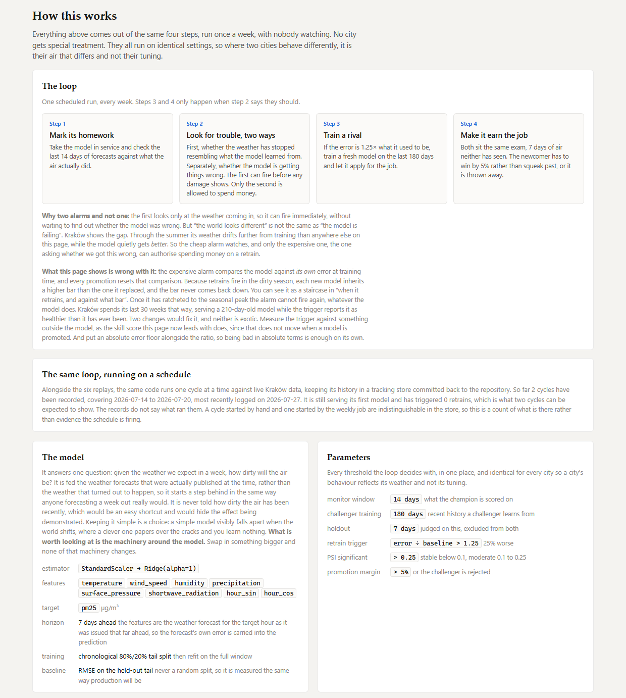

# Methodology

How the thing works. For whether it works, see [evaluation.md](evaluation.md).

The short version: a deliberately small linear model guesses a city's air quality
a week ahead from the weather forecast, and a loop around it marks its own
homework every week, trains a replacement when the marks slip, and refuses to
ship that replacement unless it wins a fair exam. Most of what follows is about
the loop. The model is the part you could throw away.

---

## What the model predicts

A city's hourly PM2.5 concentration, in micrograms per cubic metre, seven days
ahead.

The features are the weather forecast *for the target hour, as it stood a week
earlier* — pulled from Open-Meteo's archive of previous model runs, which stores
what the forecast said at the time rather than what the weather turned out to be.
So the model is answering a question a city could actually ask on a Monday: given
what we currently expect next Monday's weather to be, how dirty will the air be?

That framing costs something, and the cost is worth stating up front. At a
seven-day lead the weather forecast is already wrong by about 4.5 °C on
temperature, and the PM2.5 model inherits every bit of that before adding any
error of its own. Two error sources stacked is why the benchmarks in
[evaluation.md](evaluation.md) come out where they do.

The lead is one number, `FORECAST_LEAD_DAYS` in `config.py`. Set it to 0 and the
features come from the ERA5 reanalysis instead, which turns exactly the same code
into a same-hour estimator with no forecasting in it at all. Seven is the ceiling
rather than a choice: Open-Meteo archives previous model runs out to day seven
and no further.

Nothing downstream of the data fetch knows which of those two things it is doing.
The features and the target share one timestamp in the column contract, so the
horizon lives entirely in *which* weather the source goes and gets. The same
loop, the same drift maths and the same registry served both framings without a
line of modification, which is the strongest evidence that the machinery is not
secretly coupled to the problem.

---

## The model: Ridge, from the top



`StandardScaler → Ridge(alpha=1.0)` on eight features, trained on a chronological
80/20 tail split — never a random one — and then refit on the full window.

That is one line of scikit-learn and about five ideas underneath it. Here they
are in order, because "we used ridge regression" is the kind of sentence that
sounds like an explanation and isn't.

### Least squares, and where it comes apart

Start with the model that has no ridge in it. Fit

```
pm25  ≈  β₀  +  β₁·temperature  +  β₂·wind_speed  +  …  +  β₈·hour_cos
```

by picking the βs that make the sum of squared errors as small as possible. There
is a closed-form answer, and every statistics course writes it the same way:

```
β = (XᵀX)⁻¹ Xᵀy
```

Two things go wrong with that in general.

**Correlated features make the answer unstable.** When the columns of `X` are
close to collinear, `XᵀX` is close to singular, and inverting something close to
singular produces enormous numbers — typically a large positive slope on one
feature almost exactly cancelled by a large negative one on its neighbour. Those
slopes fit the training window beautifully and mean nothing individually; shift
the window by a week and they can swap signs.

**Every coefficient is fitted at full strength, including the ones that are
noise.** Least squares has no way to say "this feature is probably not doing
much". It gives each one whatever slope minimises training error.

In most projects that instability is only an accuracy problem. Here it would be
worse, because the coefficients are not a by-product — they are logged to the
registry on every version, plotted on both UIs, and the entire concept-drift
narrative is *watch this slope cross zero as the season turns*. A slope that
swings because two features are collinear tells that story loudly and falsely.

The weather features here *are* correlated, over Kraków's training window:

```
                     temp   wind   humid  precip  press  radiation
temperature          1.00  -0.13  -0.66   -0.16  -0.16   0.61
humidity            -0.66   0.02   1.00    0.33  -0.34  -0.62
shortwave_radiation  0.61   0.10  -0.62   -0.08   0.11   1.00
```

Warm hours are sunny and dry, which is not a surprise. But correlated is not the
same as collinear, and the honest measurement is that this design is a long way
from the pathological case: the condition number of the standardised feature
matrix is **6.9**, where trouble starts somewhere north of 30 and a genuinely
ill-posed problem runs into the thousands. Six weather variables and 1,464 hourly
rows is a comfortable ratio.

Which leads somewhere worth being upfront about, and it is measured rather than
assumed. See the alpha section below: at the shipped α = 1.0 the fitted slopes
are identical to plain least squares to three decimal places. **The
regularisation is very nearly inert at the setting that ships.** It is insurance
the model has not yet had to claim on — cheap, correct to carry, and honest to
admit is currently doing almost nothing.

### The ridge, and where the name came from

Ridge regression adds one term to what is being minimised:

```
minimise   Σᵢ (yᵢ − β₀ − Σⱼ βⱼxᵢⱼ)²   +   α · Σⱼ βⱼ²
           └───── fit the data ─────┘       └ stay small ┘
```

α is a dial between two things you want and cannot have both of. At α = 0 this is
plain least squares. As α → ∞ every slope is crushed to zero and the model
becomes "predict the training mean, forever" — which happens to be one of the
baselines in [evaluation.md](evaluation.md). That is a nice thing to notice: the
dumbest baseline on the page is the same model with the dial turned all the way
up.

The closed form is where the name comes from:

```
β = (XᵀX + αI)⁻¹ Xᵀy
```

`αI` adds α down the diagonal of `XᵀX` — a ridge running along the middle of the
matrix. That is enough to make it invertible even when the columns are collinear,
which is the whole trick, and it is exactly what Hoerl and Kennard proposed it
for in 1970: "biased estimation for nonorthogonal problems", where nonorthogonal
is the correlated-columns problem above.

The word *biased* in that title is the honest part. Ridge deliberately returns
coefficients that are too small. In exchange it returns coefficients that do not
lurch about when the training window moves by a week. For a model whose slopes
are published every time it retrains, that is a good trade — and it is the reason
to keep carrying it even where, as here, the design is well enough conditioned
that it is barely being exercised. Every challenger is fitted on a *different*
180-day window that nobody inspects first.

The intercept is left out of the penalty. Shrinking β₀ toward zero would be
shrinking the model toward predicting zero micrograms of pollution rather than
toward predicting the average, which is not a modest assumption but a mad one.
scikit-learn handles this by centring internally, so `Ridge` never penalises the
intercept and you do not have to remember to ask.

### Why the features must be standardised first

`Σβⱼ²` adds coefficients together as though they were comparable quantities. They
are not. Surface pressure sits around 1000 hPa and precipitation around 0.1 mm, so
the slope per hPa is inevitably tiny and the slope per mm inevitably large —
before anything about the physics is considered. Penalise them together in raw
units and you have not regularised the model; you have decided that pressure
matters less than rain because of the unit somebody chose to record it in.

`StandardScaler` puts every feature on mean 0 and standard deviation 1 before the
Ridge sees it, so the penalty applies to something meaningful: how much the
prediction moves per *typical* move in that feature. This is why the pipeline is
`StandardScaler → Ridge` and never a bare `Ridge`, and it is a correctness
requirement rather than a matter of taste. A ridge on unstandardised features is
a quiet bug, not a style choice.

### Getting the slopes back into units a person can read

The scaling happens inside the pipeline, so `ridge.coef_` comes out in z-score
units: µg/m³ per standard deviation of temperature, where the standard deviation
is whatever this particular training window happened to have. Two versions
trained on different windows are therefore not comparable in those units at all —
the axis moves under them.

`model.effective_coefficients` folds the scaler back in:

```
slope_j    = coef_j / scale_j
intercept  = intercept_ − Σⱼ coef_j · mean_j / scale_j
```

which gives µg/m³ per °C, per m/s, per %RH, per mm, per hPa, per W/m². Those are
comparable across versions, they are directly plottable, and they are what the
coefficient charts in both UIs draw.

They are also load-bearing for something less obvious. Because a fitted model is
now eight slopes and an intercept, `log_and_register` can write the whole thing
into registry *tags*, and [`retrospect.py`](../src/driftloop/retrospect.py) can
rebuild any version from the registry alone and score it on any window as a
weighted sum of columns — no unpickling, no refitting, no artifact paths to
resolve. Scoring Kraków's fifteen versions across its forty-eight windows is 720
model-window scorings, and the cost is dominated by reading the windows off disk
rather than by the models. Half the analysis on the published page exists because
a linear model can be serialised into nine numbers, and would have been
prohibitively awkward otherwise.

### Why not lasso, or a gradient-boosted tree

Lasso (an `|βⱼ|` penalty instead of `βⱼ²`) would drive some coefficients to
exactly zero and hand back a shorter feature list. That is usually a selling
point and is the wrong thing here: a coefficient chart where three of six
features are pinned at exactly zero tells you *less* about how the world is
changing, not more. Ridge keeps every feature in the story with a slope you can
watch move.

A gradient-boosted tree would score better. It would also absorb some of the
drift instead of decaying through it — that is largely what "robust" means for a
flexible model — and the demonstration depends on the decay being legible. A big
model would blur exactly the thing this repository is built to show.

So the model is kept small on purpose, and the honest framing is:
**the modelling is not the interesting part of this project.** The loop around it
is, and every part of that loop would be unchanged if you dropped in something
far better. Every threshold is identical across all six cities, so where two
cities behave differently it is their air that differs and not their tuning.

### Choosing alpha, and what the answer says

`alpha=1.0` ships, which is scikit-learn's default and therefore needs a
justification rather than a shrug.

It is swept per city on a logarithmic grid — α's effect is multiplicative, so
linear steps would spend most of their samples at the insensitive end — using
five-fold forward-chaining cross-validation (`TimeSeriesSplit`). Forward chaining
never lets a fold train on rows that come *after* the rows it scores. On
autocorrelated hourly data a random split leaks badly enough to make every value
of α look fine, which is a well-documented trap and not a hypothetical one
(Bergmeir & Benítez, 2012).

Every city wants heavier regularisation than 1.0:

| | best α | cost of shipping 1.0 |
|---|---|---|
| Santiago | 10 | 0.1% |
| Los Angeles | 100 | 2.1% |
| Melbourne | 1000 | 1.5% |
| Kraków | 1000 | 3.6% |
| Johannesburg | 1000 | 4.4% |
| Delhi | 1000 | 11.9% |

The curve is nearly flat, which is why 1.0 survives a sweep that disagrees with
it in every city. It is worth being concrete about how little α = 1.0 does. On
Kraków's training window, the effective slopes at α = 1.0 and at α = 10⁻⁸ agree
to three decimal places; at α = 1000 each has shrunk by somewhere between 15%
(temperature) and 49% (surface pressure). So shipping 1.0 is, to a good
approximation, shipping ordinary least squares with a safety net attached.

But the shape of the sweep's answer is the most useful thing it produces.
**If pushing every slope most of the way to zero costs between 0.1% and 12% of
error, the relationship this model can express is weak.** A fit that is barely
better than shrinking it away is not a fit to be proud of. That single
observation is the fairest summary of the modelling in this repository, and the
reason its interest lies elsewhere.

---

## The features, and why each one

Six observed weather variables, chosen for how pollution physically accumulates
and clears rather than for what was easy to fetch, plus two terms that encode the
clock.

**temperature** — colder air near the surface with warmer air above it is an
inversion: a lid, with the city underneath it. Temperature is also the cleanest
proxy available for the heating season in Kraków and the wood-burner season in
Melbourne, which is where those cities' pollution comes from in the first place.

**wind_speed** — ventilation. Wind is the single most intuitive term in the
model: still air lets pollution pile up, moving air carries it somewhere else.
It is also the slope most likely to change sign between versions, because wind
that clears a valley can also import smoke from outside it.

**humidity** — damp particles grow. Water condenses onto existing aerosol, which
makes it heavier and optically larger, and high humidity also feeds the chemistry
that turns gases into new particles.

**precipitation** — rain physically washes particulates out of the air, which
atmospheric chemists call wet deposition and everyone else calls the air smelling
better after a storm. This is the most direct removal mechanism in the list, and
also the most awkward feature statistically: it is exactly zero for between 70%
of hours (Johannesburg) and 96% (Santiago), so its distribution is a spike at
zero with a thin tail rather than anything a decile split handles gracefully.

**surface_pressure** — high pressure means air sinking from above, which warms as
it descends and forms a subsidence inversion. This is the mechanism behind
Kraków's and Santiago's winter smog: a stable high parks over a basin and puts a
lid on it for days.

**shortwave_radiation** — sunlight heats the ground, the ground heats the air, the
air rises, and the layer that pollution is mixed into gets deeper. A deeper mixing
layer is a bigger box to dilute the same emissions into. Radiation also drives
the photochemistry that makes secondary particles, so its slope is genuinely
ambiguous in sign and interesting to watch.

**The one that is missing** is boundary layer height — the depth of that box —
which would summarise most of the above in a single number and would very likely
top the "what moves the prediction" chart. Open-Meteo does not archive previous
model runs for it, so at a seven-day lead it comes back null, and using it would
mean abandoning the forecast framing entirely. Shortwave radiation is the
stand-in. This is a genuine limitation and not a modelling preference. Seinfeld
and Pandis is the standard reference for every mechanism above, if you want the
version with the equations in it.

### The clock, on a circle

The two remaining features are

```
hour_sin = sin(2π · hour / 24)
hour_cos = cos(2π · hour / 24)
```

Handing a linear model the raw integer hour would tell it that 23:00 is
twenty-three units away from midnight, when it is one hour away. Putting the day
on a circle fixes that: hour 23 and hour 0 sit next to each other, as they should,
and the pair together lets the model express a smooth daily cycle.

One honest limitation. A single sine-and-cosine pair can express exactly one peak
and one trough per day, and real urban PM2.5 is usually *bimodal* — a morning
traffic peak and an evening one, often with an overnight inversion peak as well.
Fitting both would need a second harmonic (`sin`/`cos` of `4π·hour/24`). The
model as it stands is fitting one hump to a two-hump shape, and closing that gap
is a cheap experiment that has not been run.

The obvious alternative, twenty-four one-hot dummies, was rejected for two
reasons. It would add twenty-four columns to a model with six real features, each
fitted from a twenty-fourth of the data. And a table of per-hour means *is* the
climatology baseline the model is measured against later — building it into the
model would fold the yardstick into the thing being measured.

Only the six weather features carry a PSI. The clock cannot drift: every
monitoring window contains all 24 hours, so its distribution is fixed by
construction, and a drift chart plotting it would show a flat line forever. That
is why `DRIFT_FEATURES` and `FEATURES` are two separate lists in `config.py`
rather than one.

---

## Why two signals, and not one

| Signal | What it measures | Needs labels? | Needs a model? |
|---|---|---|---|
| Data drift (PSI) | the world changed | no | no |
| Performance drift | the model is failing | yes | the champion |

Data drift needs no labels and no model at all, which is what makes it the early
warning: it can raise a hand the moment the incoming weather stops looking
familiar, without waiting to find out whether anyone got hurt. Performance drift
needs the truth to have arrived, so it is always late — and it is the only one
allowed to authorise spending money on a retrain.

Deciding "has it drifted?" by comparing champion against challenger would be
circular, and it is worth saying plainly because it is a tempting design: you
would need a challenger before you were allowed to decide you needed one.

### Data drift: PSI, and what it actually computes

The Population Stability Index compares two samples of one feature:

```
PSI = Σ over bins  (current_share − reference_share) · ln(current_share / reference_share)
```

The bin edges are the *reference* deciles, so the reference is uniform across
bins by construction and any imbalance is attributable to the current window
rather than to the binning.

Underneath the credit-scoring name it is the symmetrised Kullback–Leibler
divergence between the two binned distributions — Jeffreys divergence — which is
a formal way of saying: *if you were expecting the training window's weather, how
surprised would this window make you?* Zero means not at all. The conventional
reading, inherited from credit risk, is below 0.10 stable, 0.10–0.25 moderate,
above 0.25 significant.

### Where PSI stops meaning what it looks like it means

The formula divides by `reference_share` and takes a log, so both shares are
clamped away from zero at ε = 1e-6 to keep it finite. That clamp is where the
statistic quietly stops being a magnitude.

A bin holding zero current rows contributes

```
(1e-6 − 0.1) · ln(1e-6 / 0.1)  ≈  (−0.1) × (−11.5)  ≈  +1.15
```

— a *fixed* amount, regardless of whether the current data missed that bin by a
degree or by thirty. With ten reference deciles the ceiling is about 11.5, and
nine empty bins put roughly 10.4 of it on the board before the one surviving bin
has said anything at all.

That is not a corner case here, it is the normal state. Decomposing a late Kraków
window: temperature PSI is 12.20, of which **10.24 — 84% of it — comes from bins
holding zero current rows**, because July temperatures and December temperatures
simply do not overlap. Every city on the page sits above the 0.25 line on
essentially every run, with medians ten to forty times the threshold.

So PSI here is a dependable yes/no and an undependable how-much, and both UIs say
only the part that is true: the drift chart shows a green/amber/red band rather
than a number, and the copy says "properly different" rather than quoting a
magnitude nobody can interpret.

A two-sample Kolmogorov–Smirnov statistic is logged alongside it as a
cross-check, since it is bounded in [0, 1] and cannot saturate the same way. It
is not led with either: on 336 hourly rows per window, KS p-values are
vanishingly small for effects of no practical size, which is the usual fate of
significance testing on plenty of data.

### Performance drift, and why it is built wrong

The retrain trigger is the champion's RMSE on the monitor window against its own
RMSE at training time, at 1.25× — meaning the model has got 25% worse than it
was when it was born.

Kraków is the clearest demonstration that the two signals must stay separate, and
the clearest demonstration that this second one is broken. Through the second
half of its replay its features drift further from the training window than any
other city on the page, while the champion runs comfortably *under* its training
error. Distribution shift alone would have ordered twenty pointless retrains
there. The loop declines, and it is right to decline.

But "under its training error" is doing all the work in that sentence, and the
bar it is under was set in deep winter. The champion serving that stretch was
promoted at the seasonal peak, so its baseline is 45.8 µg/m³ and almost nothing
can cross 1.25× of it. Because every promotion resets the denominator and
promotions happen when things are at their worst, the bar ratchets: each new
champion inherits a higher one than the model it replaced, and it never comes
back down.

Measured against a yardstick that *holds still* when a model is promoted, the same
champion in the same stretch is at its worst rather than its best: skill of −1.67
against a 30-day daily profile, having been +0.43 in January.

So the loop reaches the right answer by a route that had stopped working. Both
halves of that are true and both are published.

### The second trigger, and why it is switched off

Two fixes were proposed for that: an absolute error floor alongside the ratio,
and a yardstick that does not move when a model is promoted. Both have now been
built and measured, which changed the conclusion.

The absolute floor turned out to be unbuildable. A floor has to be one number
for every city or the thresholds stop being identical, and there is no such
number: waking Los Angeles needs a floor under 18 µg/m³, where Delhi retrains
every single week. The gap between the two is empty.

The yardstick is implementable, and it is `LoopConfig.skill_floor`:

```
retrain if   rmse_now / rmse_at_training > 1.25      (the ratchet)
        or   1 − rmse_now / rmse_climatology < floor  (holds still on promotion)
```

The second term is scale-free, so one number does work everywhere, and nothing
about promoting a model can move it. It is strictly an additional way to fire,
never a way to suppress the first — a model can be bad against its own history
or bad against the cheap alternative, and either is grounds for training a
challenger. The gate still decides whether one ships. `retrain_reason` is tagged
on every run as `ratio`, `skill`, `both` or `none`, so how often each rule was
the one that spoke is a fact on the record rather than an inference.

It ships at `None`, meaning off, and the reason is that it was measured:
[`sweep_skill_floor.py`](../scripts/sweep_skill_floor.py) replays all six cities
at several floors, and at a conservative floor the outcome is identical to the
last decimal in five of the six, while at an aggressive floor it makes two cities
measurably worse for one improvement. It wakes the trigger up exactly as designed
and the waking turns out not to be worth having.
The numbers are in
[evaluation.md](evaluation.md#fixing-it-one-of-the-two-cannot-be-built-and-the-other-does-not-pay).

A knob whose measured effect is zero is still worth having in the code, because
the *next* person to propose this fix should find it already built and already
answered rather than spend a week rediscovering it.

---

## How much history a challenger gets

`challenger_train_days = 180`, and the number has a story worth reading.

It was 45. Forty-five days is a natural-looking choice — recent, responsive,
plenty of hourly rows — and it was wrong for a reason that only a full year of
replay could expose. PM2.5 is seasonal, so a challenger trained on six weeks only
ever sees one season. It wins its holdout exam honestly, serves well for a month,
and is then mismatched the moment the year turns.

With replays that stopped at the winter peak this was completely invisible;
retraining looked like an unambiguous win everywhere. Extending the replays
through the recovery, as the air gets clean again, reversed the sign: retraining
came out 29.6% *worse* in Kraków and 4.3% worse in Delhi. Widening the window to
180 days took Delhi from −4.3% to +43.8%. See
[evaluation.md](evaluation.md#what-a-full-year-exposed).

180 is argued rather than tuned, on the grounds that it spans more than one
season. A proper sweep of retrain window against retraining value has not been
run, and it is the cheapest experiment left on the table now that `retrospect`
can score any model on any window.

---

## No evaluation leak

Every number in this repository is produced on data the model being scored has
never seen. That is easy to claim and easy to get wrong, so here is the layout:

```
...........[==== challenger train ====][= holdout =] as_of
                    [====== monitor window ========]
[== champion train ==]  (much earlier, never overlaps holdout)
```

The challenger trains on a window that stops before the holdout begins. The
champion was trained long before it. Both are scored on the same unseen week, and
the challenger has to clear a 5% margin rather than edge ahead by a nose.

Two guards make this structural rather than aspirational. The loop **raises**
rather than warns if the holdout would overlap the champion's training data. And
`run_simulation` refuses a cadence shorter than the holdout, which would let a
freshly promoted champion be judged on its own training data a week later. Both
are asserted in `tests/test_loop.py`, because a leak that only shows up as
"suspiciously good results" is the kind of bug you talk yourself into believing.

The baselines are held to the same rule. A forecaster issuing seven days out may
use readings up to that moment and no later, so persistence repeats a *week-old*
observation rather than yesterday's — which makes it a much weaker baseline than
the textbook version, and a fair one.

---

## Scoring old models on windows they never served

The loop logs what it decided at the time: which champion was serving, what its
error was, and the ratio that drove the retrain. That is enough to *run* the loop
and not enough to *judge* it, because three questions need a model scored on
windows it never served.

- **Does an individual model decay?** The logged champion error is one line
  across eight different champions, so no single model's decay is visible in it.
- **Is the model worth having?** An error is only a verdict against an
  alternative you could have deployed instead.
- **Did the promotion gate work?** That needs the *replaced* champion scored on
  the windows its replacement went on to serve — a counterfactual the loop has no
  reason to compute at the time.

[`retrospect.py`](../src/driftloop/retrospect.py) answers all three without
refitting anything, using the coefficient tags described earlier. Reconstruction
is exact to the six decimals the tags carry, which `tests/test_retrospect.py`
asserts against the loop's own independently logged RMSE.

Three windowing rules keep it honest.

**The skill baseline's reference period ends a full forecast lead before the
window it scores**, so every hour it averages was observable when that forecast
was issued.

**The delivered-margin comparison starts at the run *after* a promotion.** The
monitor window at the promotion itself runs from 14 days before `as_of` while the
challenger trained up to 7 days before it, so half that window sits inside the
challenger's own training data.

**The version that *served* a window is not always the version tagged on it.** A
run that promotes monitors with the outgoing champion and then overwrites the tag
with the winner, so on promotion runs the two differ by one. `retrospect` keeps
both: `champion_version` (the tag — correct for "when did this model start", so
decay curves use it) and `serving_version` (correct for "what was in service", so
the retraining comparison uses it). And the very first run has no predecessor at
all — the bootstrap champion is registered before any monitoring cycle exists —
so a first run that promotes takes its outgoing version from the registry, as the
lowest registered version. Kraków and Los Angeles both promote on their first
run, and without that they each lost a real promotion from the gate calibration
and gained a phantom week of retraining credit.

### The skill score

```
skill = 1 − RMSE_model / RMSE_reference
```

1 is perfect, 0 is exactly as good as the reference, and negative means the
reference beat you. This is a skill score in the sense forecast verification has
used for decades (Murphy, 1988) — the family is usually written over MSE and this
uses RMSE, which gives the same ordering on a gentler scale. The choice of
reference is the whole content of the metric.

Here the reference is the **hour-of-day mean of the previous 30 days**: for each
hour of the day, what has that hour typically looked like lately. A month is long
enough to average out weather and short enough to still be the current season.

Two properties earn it the job. It is scale-free, so a filthy city and a clean
one are comparable and so are two seasons of the same city — which raw RMSE can
never be. And **its yardstick does not move when a model is promoted**, which is
exactly the property the retrain ratio lacks and the reason the two disagree
about the same model at the same moment.

Why not R²? R² is the same idea with the reference swapped for the *window's own
mean* (and the ratio taken over squared errors rather than root-mean-squared
ones). That reference is the problem: in a calm fortnight the window's own mean
is an unusually strong predictor, so R² reports catastrophe — −5.93 in Kraków's
final window — for a perfectly modest absolute error. It ends up measuring the
window's variance more than the model.

One caveat, stated wherever the number appears rather than buried: the
climatology baseline sees recent PM2.5 readings and the model never does. It is a
hard bar rather than a like-for-like comparison. That is deliberate — it is the
thing you could actually deploy instead, and if a month-old daily profile beats
the model then the model is not paying for itself. A like-for-like baseline would
have to be built from the champion's own training window, which inherits the
champion's staleness and therefore cannot measure it.

---

## What MLflow tracks

Per monitoring run, as time-series metrics: `data_drift_psi`, `perf_drift_ratio`,
`champion_rmse`/`mae`/`r2`, `champion_baseline_rmse`, per-feature `psi_*` and
`ks_*`, plus `challenger_rmse`, `champion_rmse_holdout` and `performance_gap`
when a challenger exists. Tags record `drift_detected`, `retrain_triggered` and
`promotion_decision`. Each run also leaves two artifacts behind — the champion's
predictions on the window and a per-feature distribution report — which is what
lets the dashboard show per-run detail without ever touching the data source.

Registered versions carry their learned coefficients as tags, and a promotion
moves the `champion` **alias**, which gives an auditable version history for free.

> The Model Registry needs a database backend, so this uses a local SQLite file.
> MLflow 3 replaced the old `Staging`/`Production` stage transitions with
> aliases, which is why nothing here uses stages.

---

## Serving

Three properties, because they are the ones a reviewer asks about.

**The alias is the contract, not a version number.** Nothing in the service pins
a version. Promote in the registry and `POST /reload` picks the new one up
without a redeploy or a config change — that alias is the entire seam joining the
weekly loop to production.

**Serving never writes to the tracking store.** It sets the tracking URI and
reads. It does not call `setup()`, which would create an experiment as a side
effect; a read-only consumer should leave no trace.

**The hour encoding is not reimplemented.** `add_cyclical_features` is the same
function the training path uses, so the served features cannot drift away from
the trained ones — the classic training/serving skew, closed by construction
rather than by discipline.

Timestamps are normalised to naive UTC before the hour is read off them. The
training data is GMT, so an aware timestamp from another zone has to be converted
first or the diurnal encoding would be hours out of phase with what the model
learned. `tests/test_serving.py` asserts that `12:00Z` and `14:00+02:00` predict
identically.

Predictions come back twice: `pm25` floored at zero for whoever is consuming it,
and `pm25_raw` exactly as the model said. A clamp that hides what your model is
doing is how you stop noticing that it is doing it.

The Docker image replays the loop from the committed parquet cache at build time
instead of copying the SQLite backend in. That is forced rather than chosen:
MLflow stores artifact locations as absolute URIs, so a backend built on a
developer's machine resolves to paths the container does not have. Rebuilding
inside the image is also what proves the replay is deterministic, since it
reproduces the same champion with the same baseline RMSE from the same committed
data. The install is editable for a related reason: `tracking.REPO_ROOT` is
derived from the package file's location, so a non-editable install would put the
backend inside `site-packages`.

---

## Nothing gathered is thrown away

Raw hourly observations are committed as `data_cache/*.parquet` rather than
re-fetched, so the charts always match a fixed, inspectable dataset. The forecast
lead is part of each cache filename, because the same place over the same span
holds different features at lead 0 and lead 7. The weekly Action commits
`mlflow_scheduled.db` back to the repository so each cycle continues from the
last. The published site carries its own data — a distilled `data.json` plus one
raw CSV per city, both downloadable from the live page.

---

## References

**Ridge regression**

- Hoerl, A. E., & Kennard, R. W. (1970). *Ridge Regression: Biased Estimation for
  Nonorthogonal Problems.* Technometrics, 12(1), 55–67. The original, and still
  the clearest statement of what the bias buys you.
- Hastie, T., Tibshirani, R., & Friedman, J. (2009). *The Elements of Statistical
  Learning*, 2nd ed., §3.4. [Free PDF](https://hastie.su.domains/ElemStatLearn/).
- scikit-learn user guide,
  [Ridge regression and classification](https://scikit-learn.org/stable/modules/linear_model.html#ridge-regression).

**Validating models on time series**

- Bergmeir, C., & Benítez, J. M. (2012). *On the use of cross-validation for time
  series predictor evaluation.* Information Sciences, 191, 192–213. Why a random
  split flatters an autocorrelated series.
- scikit-learn,
  [`TimeSeriesSplit`](https://scikit-learn.org/stable/modules/generated/sklearn.model_selection.TimeSeriesSplit.html).

**Drift, and systems that live with it**

- Gama, J., Žliobaitė, I., Bifet, A., Pechenizkiy, M., & Bouchachia, A. (2014).
  *A Survey on Concept Drift Adaptation.* ACM Computing Surveys, 46(4). The
  vocabulary this project uses — covariate shift versus concept drift, detect
  versus adapt.
- Widmer, G., & Kubat, M. (1996). *Learning in the Presence of Concept Drift and
  Hidden Contexts.* Machine Learning, 23(1), 69–101. Where "hidden context" comes
  from, which is what a season is.
- Sculley, D., et al. (2015). *Hidden Technical Debt in Machine Learning
  Systems.* NeurIPS. The paper that named the problem this repository is a small
  answer to.
- Breck, E., Cai, S., Nielsen, E., Salib, M., & Sculley, D. (2017). *The ML Test
  Score: A Rubric for ML Production Readiness and Technical Debt Reduction.* IEEE
  Big Data.

**PSI and distribution distance**

- Siddiqi, N. (2006). *Credit Risk Scorecards.* Wiley. Where PSI and its
  0.10 / 0.25 conventions come from.
- Jeffreys, H. (1946). *An invariant form for the prior probability in estimation
  problems.* Proc. R. Soc. A, 186, 453–461. PSI is this divergence, on binned
  data.
- scipy,
  [`ks_2samp`](https://docs.scipy.org/doc/scipy/reference/generated/scipy.stats.ks_2samp.html).

**Forecast verification**

- Murphy, A. H. (1988). *Skill Scores Based on the Mean Square Error and Their
  Relationships to the Correlation Coefficient.* Monthly Weather Review, 116(12),
  2417–2424.
- Jolliffe, I. T., & Stephenson, D. B. (2012). *Forecast Verification: A
  Practitioner's Guide in Atmospheric Science*, 2nd ed. Wiley.

**Air quality and the weather that drives it**

- Seinfeld, J. H., & Pandis, S. N. (2016). *Atmospheric Chemistry and Physics:
  From Air Pollution to Climate Change*, 3rd ed. Wiley. The standard reference
  for inversions, mixing height, wet deposition and hygroscopic growth.
- WHO (2021). [*Global Air Quality Guidelines: particulate matter, ozone,
  nitrogen dioxide, sulfur dioxide and carbon
  monoxide*](https://www.who.int/publications/i/item/9789240034228). The 5 µg/m³
  annual and 15 µg/m³ 24-hour PM2.5 guidelines Melbourne is measured against.
- Hersbach, H., et al. (2020). *The ERA5 global reanalysis.* Quarterly Journal of
  the Royal Meteorological Society, 146(730), 1999–2049. What the lead-0 framing
  reads from.
- [Open-Meteo](https://open-meteo.com/) historical forecast and air-quality APIs.
  Free for non-commercial use, no key, and it archives previous forecast runs —
  which is the only reason the seven-day framing is possible at all.

**Tooling**

- [MLflow Model Registry](https://mlflow.org/docs/latest/model-registry.html),
  including the alias model that replaced stage transitions in MLflow 3.
